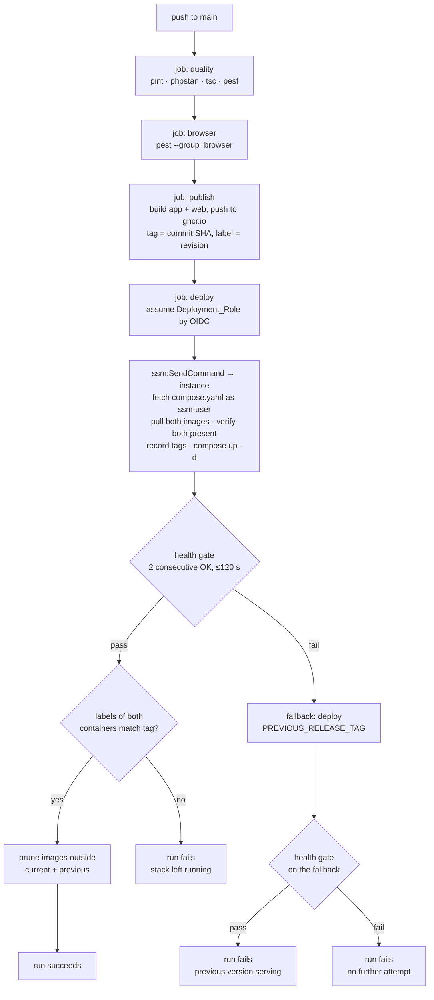

# Design Document

## Overview

A build-publish-deploy-verify-or-revert line, and nothing else. CI already runs `quality` and `browser` on every push; two jobs are added after them. The first builds the two images and pushes them to GHCR tagged with the commit SHA. The second tells the instance, over SSM Run Command, to pull that tag and bring the stack up, then polls `/health` from the runner and redeploys the previous tag if it does not answer.

Nothing new runs on the instance. No agent, no daemon, no scheduler. The whole instance-side implementation is one shell script passed to an existing SSM document, and the whole state it keeps is one file holding two lines.

The design is deliberately thin because most of it is only provable by running it. The parts that are *not* provable by running it — the IAM conditions, the ordering that protects the fallback target, and the schema rule — are where the detail sits.



## Architecture

**One workflow, four jobs chained by `needs`.** `publish` gets `needs: browser`, `deploy` gets `needs: publish`, and both carry `if: github.ref == 'refs/heads/main'`.

The alternative was a second workflow triggered by `workflow_run` on CI completing successfully. Rejected: `workflow_run` evaluates the workflow file from the default branch rather than from the triggering commit, and the SHA it exposes needs unpicking from the event payload, which is a documented source of deploying the wrong commit. A chained job knows its SHA is `github.sha` and needs no indirection (Req 2.3).

Permissions are per-job in GitHub Actions, so keeping it in one file costs nothing in least privilege:

| Job | `permissions` | Why |
| --- | --- | --- |
| `quality`, `browser` | `contents: read` | unchanged |
| `publish` | `contents: read`, `packages: write` | pushes to GHCR (Req 1.6) |
| `deploy` | `contents: read`, `id-token: write` | OIDC only; no write to the repository (Req 3.6) |

`deploy` also declares `environment: production`, which is what puts `environment:production` in the token's subject claim and what makes GitHub apply that environment's deployment-branch rule before issuing a token at all (Req 3.3a, 3.3b).

`publish` and `deploy` are skipped on a pull request and on any other branch, which satisfies Req 1.4 without a second condition: `browser` already gates on `quality`, so a red run never reaches either (Req 1.1, 1.3).

Nothing is added to the instance's software. The only new AWS resources are an OIDC provider and one role, both created by hand per the Out of Scope list.

## Components and Interfaces

### Images, tags and labels

```
ghcr.io/mirkovicuk/tic-tac-toe-app:<40-char commit SHA>
ghcr.io/mirkovicuk/tic-tac-toe-web:<40-char commit SHA>
```

Lowercase literals, not `github.repository`, because GHCR refuses an uppercase reference and this repository is `mirkovicUK/TIC-TAC-TOE` (Req 1.2). Both are built with `docker/build-push-action` against `target: app` and `target: web` of the existing `Dockerfile`, `platforms: linux/amd64` only (Req 1.1), with `cache-from`/`cache-to: type=gha` so a cold runner does not repeat Composer and npm every push.

Each image carries `org.opencontainers.image.revision=<SHA>` as a label (Req 1.8). That label is the only source the pair check trusts, for the reason Req 7.5 gives: both services take their tag from one variable, so anything read from that variable cannot disagree with itself.

No `latest` tag is published. A floating tag would give the instance a way to run something other than a named release, and nothing needs it.

### `compose.yaml` after the change

Both `build:` blocks go; two `image:` lines replace them.

```yaml
services:
  app:
    image: ghcr.io/mirkovicuk/tic-tac-toe-app:${RELEASE_TAG:?RELEASE_TAG must be set}
  web:
    image: ghcr.io/mirkovicuk/tic-tac-toe-web:${RELEASE_TAG:?RELEASE_TAG must be set}
```

`${RELEASE_TAG:?…}` rather than `${RELEASE_TAG}` or `${RELEASE_TAG:-latest}`: the `:?` form makes Compose refuse to act at all when the variable is unset or empty, which is Req 2.6 with no code to write. One variable feeds both services, so they cannot be given different tags by editing one line (Req 7.3).

Everything else in the file is untouched — no `ports:` on `app`, the two volumes with their deliberate asymmetry, `env_file: ./deploy/app.env`, the healthcheck, and the log rotation. The header comment that says the image is built on the instance is corrected (Req 9.9).

### The Deploy_Document and the deploy script

**A custom document, `DeployTicTacToe`, not `AWS-RunShellScript`** — tracked source at `deploy/ssm/DeployTicTacToe.json`, registered by hand.

This reverses an earlier decision in this design and the reason is worth stating, because the earlier version looked like least privilege and was not. `ssm:SendCommand` on `AWS-RunShellScript` is **arbitrary command execution as root**: the caller supplies the commands. Pinning the resource to one document and one instance constrains *where* a command runs, not *what* it is. The permissions policy read as tight while granting a root shell.

A Command document whose `runCommand` block is fixed inverts that. The caller supplies parameter values only, and the document supplies the commands. Three things make it actually hold rather than merely appear to (Req 3.5a, 3.5b, 3.5c):

**Every parameter is constrained.** `ReleaseTag` carries `allowedPattern: ^[0-9a-f]{40}$` and `Mode` an `allowedValues` of `deploy` or `fallback`. A parameter interpolated into a shell command is an injection path, so an unconstrained `ReleaseTag` would hand back the arbitrary execution the document exists to remove. The script re-checks the pattern in `bash` as well, which is redundant until somebody loosens the document.

**The role cannot change the document.** No `ssm:CreateDocument`, `UpdateDocument` or `DeleteDocument` is granted. A pipeline that can rewrite its own permitted script is bounded by nothing, so the document is amended out of band. **The cost is real and ongoing: every change to the deploy script is a manual `aws ssm update-document`.** That is the price of the constraint, not an oversight.

**No doubled curly brace may appear anywhere in the script**, including in a comment, except a reference to one of the two parameters. SSM's own substitution uses that delimiter, so a Go template in `docker inspect --format` would be read as a parameter reference and fail the document. The script therefore reads the revision label with `jq`, which is present on the instance. This was caught by grepping the extracted script for double braces after writing it, and it would otherwise have failed on first use.

One incidental gain: the document is owned by this account, so the permissions policy names `arn:aws:ssm:eu-west-2:811362454196:document/DeployTicTacToe` and the account-segment wildcard that an AWS-managed document forced is gone.

Run Command executes as root. The script drops to `ssm-user` for anything touching the repository clone, because that directory is owned by `ssm-user` and `git` as root there fails with `detected dubious ownership` — an error that reads as a repository fault rather than the permissions one it is (Req 4.10).

Steps, in order:

1. Take an exclusive `flock` on `deploy/.deploy.lock`, exiting non-zero if held. One deployment at a time **enforced on the instance**: GitHub's concurrency group serialises workflow runs, but a person running `send-command` by hand is outside it, and two runs would interleave on one working directory and one env file (Req 4.9).
2. Resolve the tag to deploy. In `deploy` mode that is `ReleaseTag`; in `fallback` mode the document **ignores `ReleaseTag` and reads `PREVIOUS_RELEASE_TAG` from the instance**, because the instance is the only thing that authoritatively knows it (Req 6.2).
3. `sudo -u ssm-user git fetch --depth 1` then `checkout` that SHA. The clone is still needed even though the images come from the Registry: `deploy/Caddyfile.production` is bind-mounted into `web`, and `compose.yaml` has to match the images being deployed.
4. `docker pull` both images. Explicit pulls rather than letting `up` do it, so a partial pull is caught before any container is recreated (Req 2.2, 7.4).
5. Reclaim disk **by name**, removing every image under the two repositories except the four belonging to the deploying and the retained tag, then assert 2 GiB free (Req 4.6).
6. Write the new `release.env` to a **temporary file**, and promote it with `mv` only after Compose succeeds (Req 2.5, 6.1).
7. `docker compose --env-file <tmp> up -d --wait`.
8. **Assert** that the `org.opencontainers.image.revision` label of both running containers equals the deployed tag, exiting non-zero on any mismatch (Req 7.5).
9. Print the resolved images and the promoted `release.env` — captured by Run Command and copied into the workflow log (Req 4.8).

Bounded by `--timeout-seconds 600` on the invocation (Req 4.7). A ~1 GB pull on a `t3.micro` should take a couple of minutes; ten is generous without being unbounded.

**Four of those steps are the way they are because a review found the obvious version wrong.** They are recorded here because each failure would have been silent:

- **`docker image prune -f` reclaims nothing here.** It removes *dangling* images only, and every image carries a `:<sha>` tag, so the disk guard was decorative — it would free nothing, then fail the re-check with a message implying it had tried. `prune -a` is not the fix either: it removes whatever no *running* container uses, which is precisely the retained pair the fallback depends on. Hence deletion by name against an explicit keep-set.
- **Writing `release.env` before Compose succeeded broke Property 2 of this design.** A failed `up` left the file naming a release that never ran, and the next good deployment would then record that never-ran tag as the fallback target. The temp-file-then-`mv` ordering is what makes the property true; `mv` within one filesystem is atomic, so there is no half-written window.
- **`up -d` exits 0 for a container that starts and dies two seconds later.** `--wait` blocks until every service *with a healthcheck* is healthy, so a healthcheck was added to `web` — verified against `caddy:2-alpine`, whose busybox `wget` can reach the admin API on `127.0.0.1:2019`. Without it, `--wait` would have degraded to "running" for half the stack.
- **Reading the revision label without comparing it proved nothing.** Compose may decline to recreate a container, in which case a stale one reports its old SHA into the log and the deployment passes. The comparison is now an assertion.

Two smaller consequences of the same review: containers are resolved with `docker compose ps -q <service>` rather than by the literal name `tic-tac-toe-app-1`, so the script does not depend on a naming convention even though `compose.yaml` pins the project name; and `jq` is asserted present at the top, because the document has a hard runtime dependency that nothing else declares.

### Health gate and fallback

The gate runs **on the runner**, curling `https://18-175-88-107.sslip.io/health` with certificate validation left on. That path also proves TLS terminates and that `web` reaches `app`, which a probe over the local FastCGI socket would not (Req 5.1).

Two consecutive successes, at least 5 seconds apart, within a 120-second budget, polling no less often than every 10 seconds. Two rather than one because the outgoing container can still answer briefly during recreation, so a single success may have come from the version being replaced (Req 5.2).

Failure path, in the order that matters:

1. Confirm both images of `PREVIOUS_RELEASE_TAG` are still present on the instance **before** the failing stack is disturbed. Absent, or no previous tag recorded, and the run fails with the failed deployment left running — a broken deployment still serving something beats a stopped one serving nothing (Req 6.7).
2. Set `RELEASE_TAG` to the previous value and `up -d` again. **`PREVIOUS_RELEASE_TAG` is not rewritten**, which is what leaves a last known good version in place for a second failure (Req 6.1).
3. Health-gate the fallback.
4. Fail the run either way (Req 6.4). A fallback that worked is still a deploy that did not.

### IAM

Two tracked files, so the pinning is checkable by reading the repository rather than by holding credentials (Req 3.7):

- `deploy/iam/deployment-role-trust-policy.json`
- `deploy/iam/deployment-role-permissions-policy.json`

The trust policy conditions on `StringEquals` for both claims — `token.actions.githubusercontent.com:aud` equal to `sts.amazonaws.com`, and `:sub` equal to the single value `repo:mirkovicUK/TIC-TAC-TOE:environment:production`. `StringEquals` with no wildcard is the whole point: `StringLike` with `repo:owner/name:*` would let a pull request from a fork assume the role (Req 3.3, 3.4).

**Why the subject names an environment rather than a branch, and what moves as a result.** GitHub's issuer is shared — `token.actions.githubusercontent.com`, with no tenancy segment, unlike Vercel's `oidc.vercel.com/<team>`. A per-tenant issuer URL exists but is a GitHub Enterprise Cloud feature, so on this plan the entire tenancy boundary is the subject claim. AWS treats that as a known risk rather than leaving it to the operator: it classifies GitHub Actions as a shared OIDC provider with `sub` as the designated tenancy claim, and **refuses to create or update a role trust policy that omits `token.actions.githubusercontent.com:sub`**, failing with `MalformedPolicyDocument`. It also refuses a `sub` whose value is only a wildcard.

Given that, AWS's own recommendation is environment scoping with protection rules rather than a bare branch condition. **The two forms are mutually exclusive**: a job that targets an environment presents `repo:owner/name:environment:production` and carries no `ref:` segment. So scoping to the environment *removes* the branch restriction from the trust policy, and it has to be re-established in the environment's deployment-branch rule (Req 3.3a). That is a swap of where the boundary lives, not an addition, and getting it wrong means any branch could deploy through the environment.

What it buys over the branch form: GitHub evaluates the environment's rules **before issuing the token**, so a disallowed branch never obtains a credential to present; and a required-reviewer gate becomes a checkbox later rather than a redesign. Protection rules are kept to the branch restriction alone, with no reviewers, so the friction is identical to the branch form.

The permissions policy grants two actions:

| Action | Resource |
| --- | --- |
| `ssm:SendCommand` | `arn:aws:ssm:eu-west-2:811362454196:document/DeployTicTacToe` **and** `arn:aws:ec2:eu-west-2:811362454196:instance/i-0c6bab4bc4644e760` |
| `ssm:GetCommandInvocation` | `*` |

`SendCommand` needs both resource types listed or it is denied; omitting the instance ARN would allow the role to target anything in the account. `GetCommandInvocation` is granted on `*` because no resource-level form for it is documented, and it only reads command output — that is the one place this policy is broader than I would like, and it is stated rather than hidden (Req 3.5).

`aws-actions/configure-aws-credentials` pinned by SHA, with `role-duration-seconds: 3600` (Req 3.1).

### Concurrency

```yaml
concurrency:
  group: deploy-production
  cancel-in-progress: false
```

`false` is load-bearing. Cancelling a deploy mid-flight could leave the stack down, `release.env` half-written, or a fallback abandoned. Queueing instead means two quick pushes deploy in order rather than fighting over one SQLite file (Req 4.9).

### The migration checks in `quality`

One script, `scripts/check-migrations.php`, run as a step of the existing `quality` job (Req 8.3). It parses each file in `database/migrations/` and fails on:

- a call to `dropColumn`, `renameColumn`, `dropIfExists`, `drop`, or `change` in an `up()` method
- more than one `Schema::create` or `Schema::table` call in an `up()` method

**What it cannot detect, stated plainly.** It is a syntactic check. It cannot tell that adding a non-nullable column to a populated table will fail, cannot see a raw `DB::statement` doing something destructive, and cannot judge whether a migration's one change is the *right* change. It catches the mistakes that are easy to make by habit, and no more. The rule it enforces is worth having anyway, because Laravel opens no transaction for a SQLite migration, so a migration holding one change is the cheapest way to make a partly-applied migration unrepresentable.

## Data Models

There is one piece of persistent state and it is two lines long: `/srv/tic-tac-toe/deploy/release.env`, on the instance only, untracked.

```
RELEASE_TAG=8f3c1d…
PREVIOUS_RELEASE_TAG=a22db7d…
```

| Field | Meaning | Written by | Read by |
| --- | --- | --- | --- |
| `RELEASE_TAG` | the Current_Release_Tag — the Image_Pair the stack is configured to run | the deploy script, on every deployment and on a fallback | `docker compose` interpolation; a person asking what is running |
| `PREVIOUS_RELEASE_TAG` | the fallback target | the deploy script, **only** when deploying a tag that differs from `RELEASE_TAG`, and never by a fallback | the fallback path |

Every Compose invocation passes `--env-file deploy/release.env` explicitly rather than relying on Compose's automatic `.env` lookup. That is deliberate: a file named `.env` in that directory would sit next to Laravel's own `.env` convention and invite somebody to conflate the two, and Compose's implicit lookup is the kind of behaviour that reads as magic when it goes wrong.

The file is also the answer to "what is running?" — `cat deploy/release.env` on the instance, no workflow run needed (Req 2.5).

**A correction to the reasoning Req 2.5 gives for the file persisting.** The requirement says the file must survive a reboot so `restart: unless-stopped` brings the stack up on the same tag. That restart policy acts on the *existing container*, which already has its image resolved, so Docker needs no interpolation at boot and the file is not consulted. The file still has to persist, but for the plainer reason: the next Compose invocation, whether from the pipeline or by hand, must resolve the same tag rather than nothing.

No database schema changes. No application data model is touched by this feature.

## Correctness Properties

Five invariants worth stating, because each is cheap to check and expensive to discover broken. None is expressible as a property-based test — they are properties of a deployment, not of a function — so each names how it is actually settled.

### Property 1: The running pair is always one commit

**Validates: Requirements 7.1, 7.5**

For any running stack, the `org.opencontainers.image.revision` label of the `app` container equals that of the `web` container, and both equal the Release_Tag deployed. Settled on every deployment by the label comparison (Req 7.5). The failure it guards is invisible to the health gate, which is why it needs its own check.

### Property 2: The fallback target has served successfully

**Validates: Requirements 6.1, 6.2**

After any workflow run, `PREVIOUS_RELEASE_TAG` names a release that at some point passed a health gate, or is empty on a first deployment. Holds because only a non-fallback deployment writes it (Req 6.1). Settled by reading the deploy script, not by a test.

### Property 3: `PREVIOUS_RELEASE_TAG` never equals `RELEASE_TAG`

**Validates: Requirements 6.1**

The differing-tags condition on the write gives this. Without it, redeploying the tag already running would collapse the fallback target onto the current release, leaving nothing to revert to. Settled by reading the script.

### Property 4: No credential outlives a run

**Validates: Requirements 3.2, 3.7, 3.8**

The repository holds no AWS key, no SSH key and no registry token; the instance holds no credential belonging to the workflow. Settled by reading the repository and the two policy files (Req 3.2, 3.7, 3.8).

### Property 5: Both volumes survive every deployment

**Validates: Requirements 4.4**

`sqlite-data` and `caddy-data` exist, with their original creation timestamps, after any deployment or fallback (Req 4.4). The certificate is the component whose replacement depends on a rate limit shared with strangers, so this is the invariant with the most expensive violation.

Properties 2 and 3 are the ones a reviewer should check by reading the script, because no test reaches them without a deliberately broken release.

## Error Handling

| What goes wrong | What the pipeline does | What the operator sees |
| --- | --- | --- |
| Tests fail | `publish` and `deploy` never run; nothing is pushed | Red run, no deployment |
| One image pushes, the other fails | Nothing is deleted; the partial tag is caught at deploy | Red `publish`; the instance keeps serving |
| Either image missing at pull time | Stack untouched | Red run naming the missing image |
| Disk below 3 GiB after pruning | Stack untouched, nothing brought down | Red run naming free space |
| Migration fails on container start | `set -e` stops the container, php-fpm never starts, gate fails, fallback runs | Red run; previous version serving; **new deploys blocked until fixed by hand** |
| App boots but does not serve | Gate fails after 120 s, fallback runs | Red run; previous version serving |
| Fallback also unhealthy | Left in place, no further attempt | Red run; site likely down; needs a person |
| No previous tag recorded (first deploy) | Failed deployment left running | Red run stating no fallback was possible |
| Labels of the two containers disagree | Run fails; stack left as deployed | Red run showing both labels and the expected tag |
| Run Command exceeds 600 s | Invocation fails | Red run; instance state depends where it stopped |
| Two pushes in quick succession | Second queues behind the first | Both run, in order |

The migration row is the one worth reading twice. Service stays up, because the fallback restores the previous images against the schema as the failed migration left it — but the *next* deployment reruns that migration from its start and fails on a change that already exists. Requirement 8's one-change-per-migration rule is what stops that being reachable.

### Where two criteria pull against each other

**Requirement 4.6 versus Requirement 7.5 — resolved by ordering.** 4.6 prunes images outside the current and previous tags "when a deployment concludes with a Healthy_Response". 7.5 can fail the run *after* a healthy response, when the two containers' labels disagree. Taken in the wrong order, the pipeline would prune on the way to declaring a failure.

**The label comparison runs before the prune**, and the prune runs only when the comparison passes. A mismatched pair therefore leaves every image in place, which is what someone diagnosing it will want. The retained previous pair is unaffected either way, so nothing about the fallback depends on this — it is about not destroying evidence.

**Requirement 7.5 does not trigger a fallback, and that is deliberate**, as the requirement says. A mismatched pair is a registry-state problem; redeploying the previous tag would hide it, and the fix is to republish, not to revert.

## Testing Strategy

Most of this feature is proven by running it, and pretending otherwise would be the wrong kind of thoroughness. The honest split:

**Checked statically, before anything runs.** The two IAM policy files are read to confirm `StringEquals` on both claims, no wildcard in `sub`, and both resource ARNs on `SendCommand`. `compose.yaml` is read to confirm no `build:` block, the `:?` form on both `image:` lines, and one shared variable. `scripts/check-migrations.php` gets its own test with a fixture migration of each rejected shape, because a check that cannot fail is worse than no check.

**Proven by the first real deployment.** Publication and pull, the SSM invocation path, the health gate passing, the label comparison agreeing, and the timing of a ~1 GB pull inside the 600-second bound. There is no way to rehearse these without the pipeline existing.

**Proven by one deliberate failure, and worth doing once.** Push a commit whose `app` image fails its health check — a broken `config:cache`, or a migration that throws — and watch the fallback restore the previous tag, the run go red, and `release.env` keep its previous value. This is the single most valuable test in the feature, because the fallback path is the part that only ever runs when something is already wrong. Do it deliberately, once, while watching, rather than discovering it during a real incident.

**Not tested, by choice.** The concurrency queue, the disk-headroom branch, and the no-previous-tag branch. Each is a few lines of shell whose failure mode is a red run rather than a broken deployment, and contriving them costs more than it returns.

No new test suite is added to the repository. The existing `quality` job gains the migration check; nothing else in the suite changes.

## Documentation changes

| File | Change | Criterion |
| --- | --- | --- |
| `README.md` | additive-schema rule, expand-and-contract sequence, forward-only note, how a deploy is triggered and where it is observed, and that there is no backup | 9.1–9.4 |
| `database/migrations/README.md` (new) | the additive and one-change rules, where a person writing a migration meets them | 9.2 |
| `docs/decisions/adr-012-continuous-deployment.md` (new) | decision, alternatives, reason; states what it supersedes in ADR-009 and what of that record still holds | 9.5, 9.6 |
| `docs/decisions/README.md` | index row for ADR-012 | 9.5 |
| `docs/deploy-schedule-swap.md` | **deleted** in task 9.4; the by-hand path, the break-glass path and the three parts worth keeping moved into `docs/deployment.md` (renamed from `docs/cd.md`). Amendment recorded under criterion 8 of Requirement 9 | 9.8 |
| `compose.yaml` header, `remote-tic-tac-toe/design.md` Deployment section and its ADR-009 summary, `ci.yml` permissions comment | correct the "no registry, no CD pipeline" and "built on the instance" claims | 9.9 |

ADR-009's rejection of putting an SSH private key in repository secrets **still holds and is honoured** — this design uses OIDC and stores no credential at all. What no longer holds is its decision that deploys are manual and the image is built on the box.

## Decisions

### ADR-A: One workflow with chained jobs, not a second workflow on `workflow_run`

**Decision.** `publish` and `deploy` are jobs in `.github/workflows/ci.yml`, chained with `needs`.

**Alternatives.** A separate `deploy.yml` triggered by `workflow_run`; a `repository_dispatch` from CI; a manual `workflow_dispatch`.

**Reason.** `workflow_run` evaluates the workflow file from the default branch rather than the triggering commit, and the SHA has to be dug out of the event payload — a documented way to deploy the wrong commit. Per-job `permissions` mean one file costs nothing in least privilege.

**Not claimed.** That this is better at scale. With several deployable services or environments, a separate deployment workflow reused across them is the better shape. There is one service and one environment.

### ADR-B: Select by tag, not by digest

**Decision.** `compose.yaml` names `…:${RELEASE_TAG}`, where the tag is the commit SHA.

**Alternatives.** Pin `image:` to a digest resolved at publish time; carry both.

**Reason.** A commit SHA tag is already immutable in practice — nothing republishes it, and no `latest` exists to drift. A digest would be strictly stronger and would make `release.env` unreadable at a glance, which is the file's other job. The deploy logs both resolved digests, so the evidence exists without the reference depending on it.

**Not claimed.** That a tag is as strong as a digest. A tag *can* be overwritten in a registry; the reason this is acceptable is that only CI pushes and CI never reuses a SHA, not that tags are immutable.

### ADR-C: Public GHCR, not ECR with an instance-role pull

**Decision.** Both images go to public GHCR repositories, and the instance pulls with no credential.

**Alternatives.** ECR with the instance profile authenticating; private GHCR with a token on the instance.

**Reason.** A public image needs no credential anywhere, which beats "a credential with no secret". GHCR is free for public packages, and the repository is already public, so the images expose nothing the source does not. ECR's advantage is auth, and this removes the need for auth entirely.

**Not claimed.** That public images are right in general. They publish the runtime surface to anyone who looks; that is acceptable because this repository is public by requirement and `.dockerignore` keeps `.env`, all of `deploy/`, tests and docs out of the build context.

### ADR-D: Compare the pair by image label, not by digest

**Decision.** The pair check reads `org.opencontainers.image.revision` from both running containers and compares it against the deployed tag.

**Alternatives.** Compare the two resolved digests against what `publish` recorded; compare the image references Compose used.

**Reason.** Comparing the references Compose used is *vacuous* — both derive from one variable and cannot differ, which is exactly the class of test this project has already been burnt by. The label is written by the build, so reading it back is independent evidence. Digest comparison would work equally well but needs the publish-time digests carried to the deploy job.

**Not claimed.** That the label proves image contents. A label is metadata and could be set wrongly by a future change to the build. It proves the two containers came from the same commit's build, which is the failure being guarded against.

## Assumptions I could not verify

- **That the GHCR packages will be public.** New GHCR packages inherit private visibility on first push and must be made public once, by hand, in the package settings. Until that is done the instance cannot pull, and the symptom will be a pull failure on the first deploy. This is a one-off step and belongs in the tasks.
- **That `t3.micro` can pull ~1 GB inside the 600-second bound.** Untested. The first run measures it; the bound is a guess with headroom.
- **That `docker/build-push-action` with `cache-from: type=gha` meaningfully reduces the publish step.** Expected but unmeasured on this project's Dockerfile.
- **That `ssm:GetCommandInvocation` has no resource-level form.** I found no documentation for one, and every AWS example grants it on `*`. If a narrower form exists, the policy should use it.
- **~~The exact SSM document ARN format for an AWS-managed document.~~ No longer applicable.** The Deploy_Document is owned by this account, so its ARN carries the account id and needs no wildcard. This assumption is what the switch away from `AWS-RunShellScript` incidentally retired.
