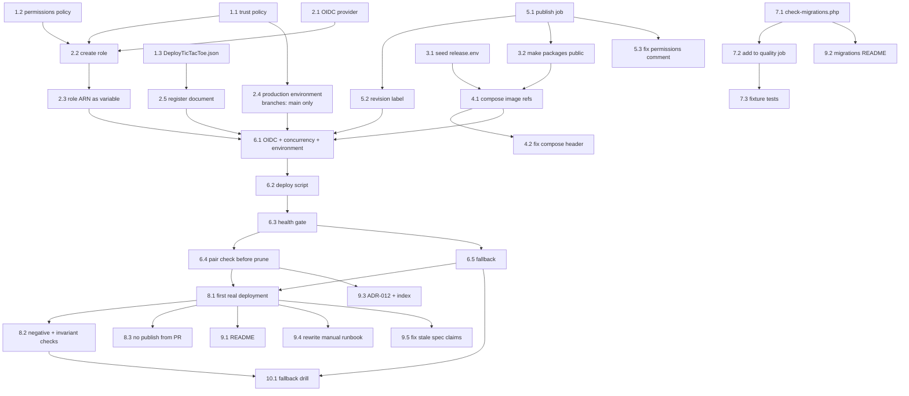

# Implementation Plan

## Overview

Ten groups. Groups 1 to 3 are preparation that changes nothing about how the application currently deploys, so they are safe to land ahead of the pipeline. Group 4 is the point of no return: once `compose.yaml` names images instead of building them, the manual `--build` loop no longer works and `docs/deploy-schedule-swap.md` is briefly wrong until group 9 fixes it. Groups 5 and 6 build the pipeline. Group 10 is the drill that proves the part nothing else can.

Sequencing note: **seed `release.env` on the instance before landing group 4**, or the first Compose invocation after the change refuses to start the stack.

## Tasks

- [x] 1. The IAM policy documents, as tracked files
  - [x] 1.1 Write `deploy/iam/deployment-role-trust-policy.json`
    - Federated principal is the GitHub OIDC provider ARN in account `811362454196`
    - `StringEquals` on `token.actions.githubusercontent.com:aud` = `sts.amazonaws.com`
    - `StringEquals` on `token.actions.githubusercontent.com:sub` = `repo:mirkovicUK/TIC-TAC-TOE:environment:production`, with no wildcard character anywhere in the value
    - **Environment scoping, not a branch reference, and the branch restriction moves as a result.** A job targeting an environment presents `environment:` in its subject and carries no `ref:` segment, so the two forms are mutually exclusive. The branch boundary is re-established by the environment's deployment-branch rule in task 2.4, and without that rule any branch could deploy through the environment
    - Comment in the surrounding documentation, not the JSON, that `StringLike` with `repo:owner/name:*` would let a pull request from a fork assume the role — this is the whole reason the condition is written this way. Note also that AWS classifies GitHub Actions as a shared OIDC provider with `sub` as its tenancy claim, and refuses a trust policy that omits it with `MalformedPolicyDocument`
    - _Requirements: 3.3, 3.4, 3.7_
  - [x] 1.2 Write `deploy/iam/deployment-role-permissions-policy.json`
    - `ssm:SendCommand` on **both** `arn:aws:ssm:eu-west-2:811362454196:document/DeployTicTacToe` and `arn:aws:ec2:eu-west-2:811362454196:instance/i-0c6bab4bc4644e760`
    - `ssm:GetCommandInvocation` on `*`, which is the one deliberately broad grant and is recorded as such in the design
    - **No `ssm:CreateDocument`, `UpdateDocument` or `DeleteDocument`.** A pipeline that can rewrite its own permitted script is constrained by nothing
    - No action against any other instance and no action against any other service
    - _Requirements: 3.5, 3.7_

  - [x] 1.3 Write `deploy/ssm/DeployTicTacToe.json`
    - Command document, schema 2.2, one `aws:runShellScript` step whose `runCommand` block is fixed by the document
    - Parameters: `ReleaseTag` with `allowedPattern` `^[0-9a-f]{40}$`, and `Mode` with `allowedValues` `deploy` / `fallback`. An unconstrained parameter interpolated into a shell command is an injection path and would restore the arbitrary execution this document exists to remove
    - **No doubled curly brace anywhere in the script except a reference to those two parameters, including inside a comment.** SSM uses that delimiter for its own substitution, so a Go template in `docker inspect --format` would be read as a parameter reference and fail the document. The script reads the revision label with `jq`, which is present on the instance
    - Verify by extracting the `runCommand` array, running `bash -n` over it, and grepping for doubled braces that are not one of the two parameters
    - _Requirements: 3.5a, 3.5b, 4.7, 4.10, 6.1, 7.4_

- [ ] 2. Provision the AWS identity, by hand
  - [ ] 2.1 Create the GitHub OIDC provider
    - `aws iam create-open-id-connect-provider --url https://token.actions.githubusercontent.com --client-id-list sts.amazonaws.com`
    - No thumbprint argument; AWS manages GitHub's
    - Only a Vercel provider exists in the account today, so this is a first for GitHub
    - _Requirements: 3.1_
  - [ ] 2.2 Create the Deployment_Role from the two policy files
    - `create-role` with `--assume-role-policy-document file://deploy/iam/deployment-role-trust-policy.json`, then attach the permissions policy
    - Record the role ARN; the workflow needs it, and it is not a secret
    - **Verify the trust policy refuses the wrong caller** rather than only that it accepts the right one: confirm the `sub` condition is present and contains no wildcard, since AWS itself rejects a policy whose `sub` condition is solely a wildcard but will accept one that is merely too broad
    - _Requirements: 3.1, 3.3_
  - [ ] 2.3 Add the role ARN as a repository variable, not a secret
    - It identifies a role that only this repository's Deployment_Environment may assume, so it is not sensitive; a variable rather than a secret keeps it readable in the workflow file's context
    - _Requirements: 3.2_
  - [ ] 2.4 Create the `production` environment and restrict its deployment branches
    - GitHub: Settings → Environments → New environment, named `production`
    - Under Deployment branches, select **Selected branches** and add `main` only
    - No required reviewers and no wait timer — the friction stays identical to a branch condition; a reviewer gate is a checkbox to add later without touching AWS
    - **This rule is the whole branch boundary.** Task 1.1 scopes the trust policy to `environment:production`, which carries no branch information, so without this restriction a run on any branch that targets the environment could assume the role. GitHub evaluates it before issuing a token, which is why it is stronger than the branch condition it replaces
    - _Requirements: 3.3a_

  - [ ] 2.5 Register the Deploy_Document in Systems Manager
    - `aws ssm create-document --name DeployTicTacToe --document-type Command --document-format JSON --content file://deploy/ssm/DeployTicTacToe.json`
    - Confirm with `aws ssm describe-document --name DeployTicTacToe` that it is `Active` and owned by this account
    - **Every later change to the deploy script needs `aws ssm update-document` by hand.** The Deployment_Role is granted no document-write action on purpose, because a pipeline that can rewrite its own permitted script is constrained by nothing. This is the ongoing cost of the constraint
    - _Requirements: 3.5a, 3.5c_

- [ ] 3. Prepare the instance
  - [ ] 3.1 Seed `deploy/release.env` with the currently deployed commit
    - `RELEASE_TAG` set to the SHA the running stack was built from; `PREVIOUS_RELEASE_TAG` left empty
    - Owned by `ssm-user`, mode 600, in `/srv/tic-tac-toe/deploy/`
    - **This must be done before group 4 lands**, because the `:?` form in `compose.yaml` makes Compose refuse to act with the variable unset — which is the intended behaviour and would otherwise strand the instance
    - Add it to `.gitignore` alongside `deploy/app.env`
    - _Requirements: 2.5, 2.6_
  - [ ] 3.2 Make both GHCR packages public, after the first publish
    - New GHCR packages inherit private visibility, and a private package cannot be pulled without a credential the instance deliberately does not hold
    - This is the assumption most likely to break the first deployment; the symptom is a pull failure, not an auth prompt
    - Sequence: land group 5, let it publish once, set both packages public, then land group 6
    - _Requirements: 1.5, 3.8_

- [ ] 4. Point `compose.yaml` at the Registry
  - [ ] 4.1 Replace both `build:` blocks with `image:` references
    - `ghcr.io/mirkovicuk/tic-tac-toe-app:${RELEASE_TAG:?RELEASE_TAG must be set}` and the same shape for `web`
    - The `:?` form, not `${RELEASE_TAG}` and never `${RELEASE_TAG:-latest}`: it makes Compose refuse rather than resolve to something unintended
    - One variable feeds both services, so they cannot be given different tags by editing one line
    - Lowercase path literals, because GHCR refuses an uppercase reference and the repository is `mirkovicUK/TIC-TAC-TOE`
    - Leave everything else untouched — no `ports:` on `app`, both volumes with their deliberate asymmetry, `env_file`, the healthcheck, the log rotation
    - _Requirements: 2.1, 2.6, 7.3_
  - [ ] 4.2 Correct the `compose.yaml` header comment
    - It currently states the image is built on the instance and that there is no registry and no CD pipeline
    - _Requirements: 9.9_

- [ ] 5. The `publish` job
  - [ ] 5.1 Add `publish` to `.github/workflows/ci.yml`
    - `needs: browser`, `if: github.ref == 'refs/heads/main'`, `permissions: { contents: read, packages: write }`
    - `docker/build-push-action` pinned by SHA, once per target, `platforms: linux/amd64` only
    - Tag each image with the full 40-character commit SHA; publish no `latest`
    - `cache-from`/`cache-to: type=gha` so a cold runner does not repeat Composer and npm on every push
    - _Requirements: 1.1, 1.2, 1.3, 1.4, 1.6_
  - [ ] 5.2 Set the revision label on both images
    - `org.opencontainers.image.revision` carrying the commit SHA
    - This is the value the pair check in 6.4 reads back; it must come from the build, not from the deployment environment
    - _Requirements: 1.8_
  - [ ] 5.3 Correct the `permissions` comment in `ci.yml`
    - It states that nothing in the workflow writes to the repository or publishes anything, which `publish` makes false
    - _Requirements: 9.9_

- [ ] 6. The `deploy` job
  - [ ] 6.1 Assume the role by OIDC and add the concurrency group
    - `environment: production` on the job — without it the token's subject carries `ref:` rather than `environment:` and the trust policy from task 1.1 refuses the assumption
    - `permissions: { contents: read, id-token: write }`; `aws-actions/configure-aws-credentials` pinned by SHA with `role-duration-seconds: 3600`
    - `concurrency: { group: deploy-production, cancel-in-progress: false }` — `false` is load-bearing, because cancelling mid-deploy could leave the stack down or `release.env` half-written
    - _Requirements: 3.1, 3.3b, 3.6, 4.9_
  - [ ] 6.2 Write the deploy script and send it by Run Command
    - `ssm:SendCommand --document-name DeployTicTacToe --timeout-seconds 600` with the `ReleaseTag` and `Mode` parameters; the workflow passes no commands, because the document holds them
    - Order: fetch and checkout the SHA **as `ssm-user`**; check free space and prune if below 3 GiB; `docker pull` both explicitly; `docker image inspect` both and stop if either is missing; rewrite `release.env`; `compose --env-file deploy/release.env up -d`
    - **Every repository operation runs as `ssm-user`.** Run Command executes as root, and `git` as root in `/srv/tic-tac-toe` fails with `detected dubious ownership`, which reads as a repository fault rather than the permissions one it is
    - `PREVIOUS_RELEASE_TAG` is written **only** when the tag being deployed differs from the current one
    - Copy the invocation's stdout and stderr into the workflow log whatever its status
    - _Requirements: 2.2, 4.1, 4.2, 4.6, 4.7, 4.8, 4.10, 6.1, 7.4_
  - [ ] 6.3 Add the health gate
    - Poll `https://18-175-88-107.sslip.io/health` from the runner, certificate validation left on, at no more than 10-second intervals within a 120-second budget
    - Pass requires **two consecutive** successes at least 5 seconds apart, because the outgoing container can still answer during recreation and one success may have come from the version being replaced
    - Treat a failure status, an unreachable-persistence body, and no response alike as breaking the consecutive run
    - Log the poll count and the final status; on failure also log the health status Compose reports for `app`
    - _Requirements: 5.1, 5.2, 5.3, 5.4, 5.5_
  - [ ] 6.4 Add the pair check, ordered before the prune
    - Read `org.opencontainers.image.revision` from both running containers, compare the two against each other and against the deployed tag, and fail the run on any disagreement
    - **The comparison runs before the image prune**, so a mismatch leaves every image in place for diagnosis. This is the resolution the design records for requirement 4.6 firing on a healthy response while 7.5 can fail the run afterwards
    - A mismatch does **not** trigger the fallback: it is a registry-state problem, and the fix is to republish rather than to revert
    - _Requirements: 4.6, 7.5_
  - [ ] 6.5 Add the fallback
    - Confirm both images of `PREVIOUS_RELEASE_TAG` are present **before** the failing stack is disturbed; if absent or unrecorded, fail with the failed deployment left running
    - Deploy the previous pair without rewriting `PREVIOUS_RELEASE_TAG`, health-gate it, and fail the run either way
    - At most one fallback per run; if its gate also fails, leave it and attempt nothing further
    - Log the failed tag, the tag deployed in its place, and the outcome
    - _Requirements: 6.2, 6.3, 6.4, 6.5, 6.6, 6.7, 6.8_

- [ ] 7. The migration rules and their check
  - [ ] 7.1 Write `scripts/check-migrations.php`
    - Fail on `dropColumn`, `renameColumn`, `dropIfExists`, `drop` or `change` inside an `up()` method
    - Fail on more than one `Schema::create` or `Schema::table` call inside an `up()` method
    - State in the file's header what it cannot detect: a non-nullable column added to a populated table, a destructive raw `DB::statement`, or whether the one change is the right change
    - _Requirements: 8.3, 8.8_
  - [ ] 7.2 Add the check as a step of the `quality` job
    - It must fail the job, not warn
    - _Requirements: 8.3_
  - [ ] 7.3 Test the check against a fixture of each rejected shape
    - A check that cannot fail is worse than no check, and this project has one recorded incident of exactly that
    - Cover: a dropped column, a renamed column, two `Schema::table` calls in one `up()`, and one valid additive migration that must pass
    - _Requirements: 8.3_

- [ ] 8. Verify the first real deployment
  - [ ] 8.1 Push a trivial commit and watch the whole line
    - Confirm: both images published and labelled; the instance pulled rather than built; `release.env` updated; both container labels equal the deployed SHA; the gate passed on two consecutive responses
    - Measure the pull time against the 600-second bound and record it, since that bound is currently a guess
    - _Requirements: 1.1, 2.2, 2.5, 5.2, 7.5_
  - [ ] 8.2 Re-run the negative and invariant checks on the instance
    - `sudo ss -ltnp | grep 9000` finds nothing, and `docker compose ps` shows no published port on `app`
    - Both volumes still present with their original creation timestamps
    - `deploy/app.env` unchanged in contents and modification time
    - _Requirements: 4.3, 4.4, 4.5_
  - [ ] 8.3 Confirm nothing was pushed from a branch or a pull request
    - Open a throwaway pull request and confirm `quality` and `browser` run while `publish` and `deploy` are skipped
    - _Requirements: 1.4_

- [ ] 9. Documentation
  - [ ] 9.1 Update the README
    - The additive-schema rule, the expand-and-contract sequence, and one schema change per migration
    - That schema changes move forward only and an image rollback does not reverse a migration
    - How a deploy is triggered, where its outcome is observed, and that a failed gate redeploys the previous tag
    - That no backup of the database volume exists and what its loss costs
    - _Requirements: 9.1, 9.2, 9.3, 9.4_
  - [ ] 9.2 Add `database/migrations/README.md`
    - The additive and one-change rules where a person writing a migration will actually meet them
    - _Requirements: 9.2_
  - [ ] 9.3 Write `docs/decisions/adr-012-continuous-deployment.md` and index it
    - Decision, alternatives, reason, in the form the other eleven records use
    - State that it supersedes ADR-009's "No continuous deployment, deliberately" section, that ADR-009's rejection of an SSH key in repository secrets **still holds and is honoured**, and that what no longer holds is manual deploys and building on the box
    - Carry across the design's four ADR-style records and what each deliberately does not claim
    - _Requirements: 9.5, 9.6_
  - [ ] 9.4 Rewrite `docs/deploy-schedule-swap.md` as the by-hand path
    - Deploying a named Release_Tag and restoring the previous one by hand, for when the pipeline itself is broken
    - Remove the build-on-the-box loop and its rebuild table; keep the swap, the sweep crontab and the prune guidance
    - _Requirements: 9.8_
  - [ ] 9.5 Correct the stale claims in the `remote-tic-tac-toe` spec
    - The Deployment section of its design and that document's ADR-009 summary both state there is no registry and no CD pipeline
    - _Requirements: 9.9_

- [ ] 10. The fallback drill
  - [ ] 10.1 Deliberately deploy a release that fails its health check
    - Push a commit whose `app` container cannot serve — a migration that throws is the closest thing to a real failure
    - Confirm: the gate fails after its budget; both previous images were verified present before anything was disturbed; the previous pair is deployed and passes its own gate; the run goes **red** despite the site being up; and `release.env` still names the same `PREVIOUS_RELEASE_TAG` it did before
    - Then revert the commit and confirm the next deployment is ordinary
    - **This is the single most valuable check in the feature**, because the fallback path runs only when something is already wrong. Do it once, deliberately, while watching — not for the first time during a real incident
    - _Requirements: 6.1, 6.2, 6.3, 6.4, 6.5_

---

## Task Dependency Graph



```json
{
  "waves": [
    { "wave": 1, "tasks": ["1.1", "1.2", "2.1", "3.1", "7.1"] },
    { "wave": 2, "tasks": ["2.2", "2.5", "5.1", "7.2"] },
    { "wave": 3, "tasks": ["2.3", "2.4", "5.2", "5.3", "3.2", "7.3"] },
    { "wave": 4, "tasks": ["4.1"] },
    { "wave": 5, "tasks": ["4.2", "6.1", "9.2"] },
    { "wave": 6, "tasks": ["6.2"] },
    { "wave": 7, "tasks": ["6.3"] },
    { "wave": 8, "tasks": ["6.4", "6.5"] },
    { "wave": 9, "tasks": ["8.1", "9.3"] },
    { "wave": 10, "tasks": ["8.2", "8.3", "9.1", "9.4", "9.5"] },
    { "wave": 11, "tasks": ["10.1"] }
  ]
}
```

The critical path is `1.1/1.2 → 2.2 → 2.3 → 6.1 → 6.2 → 6.3 → 6.5 → 8.1 → 8.2 → 10.1`.

Three edges are ordering hazards rather than mere dependencies, and each is the reason a task exists where it does:

- **3.1 before 4.1.** Landing the `image:` change before `release.env` exists strands the instance — Compose refuses to act on an unset variable, which is correct and still an outage.
- **5.1 before 3.2 before 6.1.** The packages must exist before they can be made public, and must be public before the instance can pull without a credential.
- **6.4 before the prune inside 6.2.** The pair check must run before images are removed, or a failing run destroys the evidence.

Group 7 is independent of the pipeline and can be done at any point. Group 9 mostly waits on 8.1, because the documentation should describe a pipeline that has been observed working rather than one that is intended to.

## Notes

### What is deliberately not built

Taken from the requirements' Out of Scope section, repeated here so nobody adds it while implementing: no zero-downtime or blue/green deployment, no canary, no second instance, **no database backup or restore**, no monitoring or alerting beyond a red workflow run, no staging environment, no automatic migration reversal, and no manual-trigger deployment.

### The one-off manual steps, in the order they must happen

1. Land groups 1, 2 and 3.1 — policies written, role created, `release.env` seeded
2. Land group 5 so `publish` runs once
3. **Make both GHCR packages public** (task 3.2) — private is the default and the instance holds no credential
4. Land group 4, then group 6

Landing group 4 before `release.env` exists strands the instance: Compose will refuse to start anything, which is correct behaviour and still an outage.

### Optional

Nothing in this plan is marked optional. It is small enough that every task earns its place, and the two verification groups — 8 and 10 — are where the evidence comes from, since the design records that most of this feature is only provable by running it.
