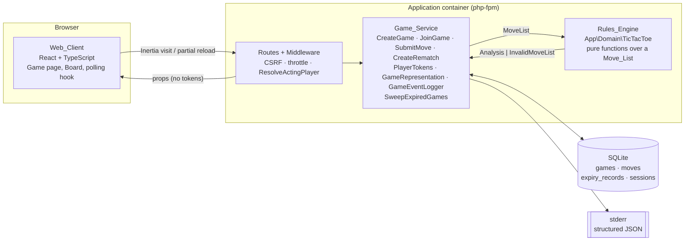
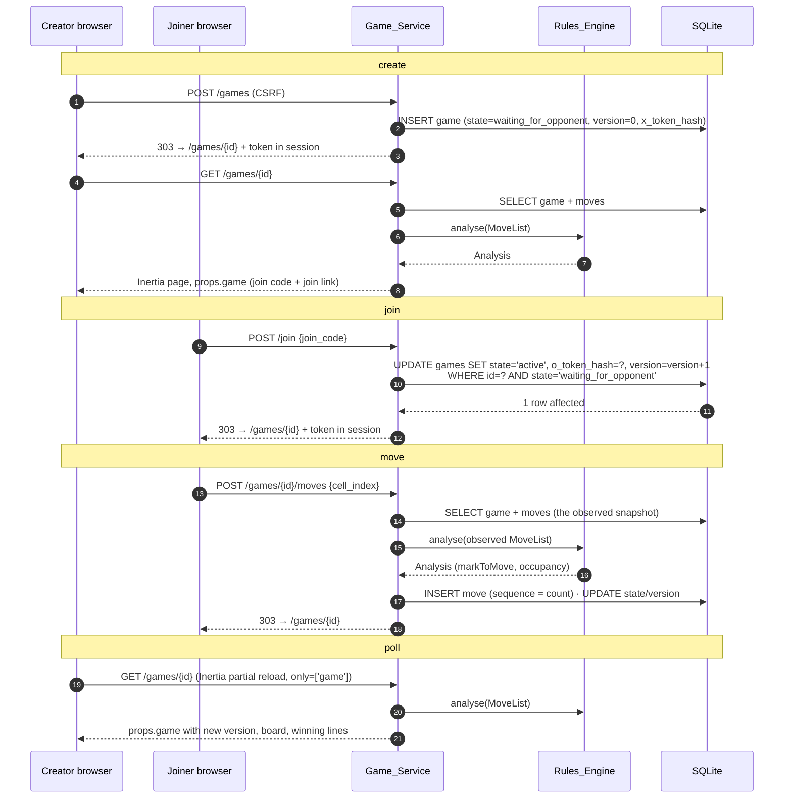
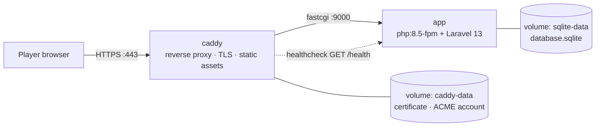

# Design Document

## Overview

Remote Tic-Tac-Toe is a small Laravel application serving an Inertia + React client. Two players play a 3x3 game from separate browsers; each sees the other's move without refreshing because the client polls the server for the game's state.

The design has one deliberate centre of gravity: a framework-free domain namespace, `App\Domain\TicTacToe`, that derives everything about a game from its list of moves. Board occupancy, the mark to move, the outcome and the completed winning lines are all *derived*, never stored. That single decision is what makes the exhaustive verification in Requirement 14, criterion 2 possible, and it is the part of the codebase a reviewer should read first.

Everything else is deliberately ordinary. The Game_Service is a handful of single-purpose action classes over three Eloquent models. There is no repository layer, no event bus, no CQRS split, no state-machine library, and no service container gymnastics. Persistence is SQLite on a Docker named volume. State synchronisation is polling. Where the framework already supplies an answer — sessions, CSRF, rate limiting, validation, migrations, queues we do not use — this document says so and moves on.

### Scope posture

The brief asks for create, join, play, end-of-game signalling and a subsequent game, with documentation and a hosted instance, in "no more than a few hours". The requirements document adds the operational concerns the role is graded on: authorisation, observability, rate limiting, retention and automated verification. This design covers exactly those and stops. Anything absent from the requirements — accounts, chat, spectators, WebSockets, turn timers — is absent here too, and the Out of Scope section of the requirements records why.

### Traceability

Design elements are annotated with the requirement criteria they satisfy, in the form `(Req 4.3)` meaning Requirement 4, criterion 3. Annotations are used where they aid review rather than exhaustively; the Testing Strategy section closes the loop by mapping every criterion of Requirement 14 to a named test file.

### Technology choices

| Concern | Choice | Note |
| --- | --- | --- |
| Runtime | PHP 8.5 on the official `php:8.5-fpm` image (Debian-based) | Multi-stage build; no Ubuntu base |
| Framework | Laravel 13 | Supports PHP 8.3–8.5 |
| Client | Inertia v2 + React 19 + TypeScript | No separate API; props are the contract |
| Updates | Polling via Inertia partial reloads | ADR-001; Req 8 |
| Persistence | SQLite on a Docker named volume | WAL, busy timeout, foreign keys on |
| Tests | Pest 4 (unit, feature, browser) | Browser testing is Playwright-based, not Dusk |
| Client tests | Vitest | The two polling/idle hooks and the component rendering assertions |
| Property-based tests | Eris (`giorgiosironi/eris`) | Unbounded input domains only; fallback recorded in Testing Strategy |
| Static analysis | Larastan (fallback: PHPStan on `App\Domain` only) | See Testing Strategy |
| Formatting | Pint in check mode | `pint --test` in CI |
| CI | GitHub Actions on push and pull request | Req 12.9 |
| Hosting | EC2 + Elastic IP, Docker Compose, Caddy reverse proxy | Req 12.4 |

Larastan resolving against Laravel 13 is verified at the first `composer install`. If it does not resolve, the fallback is plain PHPStan pointed at `App\Domain\TicTacToe` at level max — possible precisely because that namespace has no framework dependencies — with the rest of `app/` covered by Pint and the test suite. The fallback is recorded so the CI job never becomes the reason the deliverable stalls.

---

## Architecture

### Components



Three rules govern the boundaries:

1. **The Rules_Engine depends on nothing.** No `Illuminate\*`, no models, no session, no request. It takes a `MoveList` and returns an `Analysis` (Req 11.1, 11.9). An architecture test enforces this mechanically.
2. **The Game_Service owns everything stateful.** Persistence, tokens, authorisation, rate limits, logging, lifecycle (Req 2, 3, 5, 10, 13). It is the only component that knows a database exists.
3. **The Web_Client renders props and submits actions.** It holds no rules. It never receives a token value (Req 8.7), and it receives no game data at all unless the session holds a valid token for that game (Req 3.10).

### Request paths

Five paths carry the whole feature.



The rematch path is the move path with a different action: `POST /games/{id}/rematch` resolves the acting player on the preceding game, creates the rematch if none exists, increments the preceding game's Version_Counter (Req 7.5), mints a token for the requesting session bound to the swapped mark (Req 7.6), and redirects to the new game. It is idempotent: the second player's "go to rematch" control posts to the same endpoint, receives the existing rematch (Req 7.9, 7.15) and gets their own token minted at that moment (Req 7.6). This is why the client never links directly to a rematch URL — a plain link would land on a game for which the session holds no token and be refused.

### Why the Rules_Engine boundary is drawn here

Requirement 11 asks for rules "expressed as a pure derivation from the move list". The practical consequence is that the entire rule set is testable by walking the game tree in memory, with no database, HTTP kernel or browser. Requirement 14.2 then asks for exactly that walk. If the rules lived in an Eloquent model or a controller, the walk would cost a database round trip per node and 549,946 nodes would be unaffordable. The boundary is not architectural decoration; it is what makes the strongest test in the suite cheap enough to run in CI.

---

## Components and Interfaces

### 1. The domain layer: `App\Domain\TicTacToe`

Seven types, one entry point, no dependencies.

```php
namespace App\Domain\TicTacToe;

enum Mark: string
{
    case X = 'x';
    case O = 'o';

    /** Req 11.4, 4.1: mark is derived from sequence parity, never stored. */
    public static function forSequenceIndex(int $sequenceIndex): self
    {
        return $sequenceIndex % 2 === 0 ? self::X : self::O;
    }

    public function opponent(): self
    {
        return $this === self::X ? self::O : self::X;
    }
}

final readonly class Move
{
    public function __construct(
        public int $cellIndex,
        public int $sequenceIndex,
    ) {}

    public function mark(): Mark
    {
        return Mark::forSequenceIndex($this->sequenceIndex);
    }
}

final readonly class MoveList implements \Countable, \IteratorAggregate
{
    /** @param list<Move> $moves */
    private function __construct(public array $moves) {}

    public static function empty(): self;

    /** Sequence indices are the positions, so this always builds a contiguous list. */
    public static function fromCellIndices(int ...$cellIndices): self;

    /** @param list<Move> $moves Accepted verbatim, including ill-formed input. */
    public static function fromMoves(array $moves): self;

    public function append(int $cellIndex): self;   // sequenceIndex = $this->count()

    public function count(): int;
    /** @return list<int> */
    public function cellIndices(): array;
    /** @return \Traversable<int, Move> */
    public function getIterator(): \Traversable;
}

enum WinningLine
{
    case TopRow; case MiddleRow; case BottomRow;
    case LeftColumn; case MiddleColumn; case RightColumn;
    case MainDiagonal; case AntiDiagonal;

    /** @return array{int, int, int} */
    public function cells(): array;

    /** @return list<self> All eight lines. */
    public static function all(): array;
}

final readonly class Board
{
    /** @param array<int, Mark|null> $cells Exactly nine entries keyed 0..8. */
    public function __construct(private array $cells) {}

    public function occupantOf(int $cellIndex): ?Mark;
    public function isOccupied(int $cellIndex): bool;
    /** @return list<int> */
    public function vacantCells(): array;
    /** @return array<int, Mark|null> */
    public function cells(): array;
}

enum Outcome: string
{
    case InProgress = 'in_progress';
    case WonByX = 'won_by_x';
    case WonByO = 'won_by_o';
    case Drawn = 'drawn';

    public static function wonBy(Mark $mark): self;
    public function isTerminal(): bool;      // WonByX | WonByO | Drawn
    public function winner(): ?Mark;         // null unless won
}

final readonly class Analysis
{
    /** @param list<WinningLine> $winningLines */
    public function __construct(
        public Board $board,
        public Outcome $outcome,
        public Mark $markToMove,
        public array $winningLines,
        public int $moveCount,
    ) {}

    public function winner(): ?Mark;
    public function isTerminal(): bool;
}

/** Req 11.5: one uniform, detail-free rejection value. */
enum InvalidMoveList
{
    case Error;
}

final class RulesEngine
{
    public static function analyse(MoveList $moveList): Analysis|InvalidMoveList;
}
```

#### Why validation lives at the engine boundary rather than in constructors

`Move` carries plain integers, and `MoveList::fromMoves()` accepts whatever it is given. Refinement types (`CellIndex`, `SequenceIndex` validating in their constructors) would make an ill-formed Move_List unrepresentable — and Requirements 11.5 and 14.8 require the engine to be *handed* ill-formed lists and to reject them. Well-formedness is therefore a property the engine checks, not a property the type system asserts. The HTTP layer independently rejects malformed input before it ever reaches the engine (Req 11.6), so the engine's check is a guard against defects rather than against users.

#### `RulesEngine::analyse` — the whole derivation

One entry point returning one aggregate. Three separate public functions for board, mark-to-move and outcome would each need their own well-formedness check, and Requirement 11.5's "halt immediately and report only a single uniform error state" would then have three implementations. One function, one pass, one place to halt.

```
analyse(moveList):
    if count(moveList) > 9                      -> InvalidMoveList::Error   # length
    cells      = [null x 9]
    lines      = []
    lastMark   = null

    for position, move in moveList:
        if lines != []                          -> InvalidMoveList::Error   # move after a win
        if move.sequenceIndex != position       -> InvalidMoveList::Error   # gap / duplicate / not from zero
        if move.cellIndex not in 0..8           -> InvalidMoveList::Error   # range
        if cells[move.cellIndex] != null        -> InvalidMoveList::Error   # repeated cell

        lastMark               = move.mark()                                # parity
        cells[move.cellIndex]  = lastMark
        lines                  = completedLinesFor(cells, lastMark)         # all eight checked

    outcome = lines != []            ? Outcome::wonBy(lastMark)
            : count(moveList) == 9   ? Outcome::Drawn
            :                          Outcome::InProgress

    return new Analysis(
        board:        new Board(cells),
        outcome:      outcome,
        markToMove:   Mark::forSequenceIndex(count(moveList)),
        winningLines: lines,
        moveCount:    count(moveList),
    )
```

Five things about this loop are load-bearing:

- **The five well-formedness classes map one-to-one onto the five guards**, in the order the requirements list them, and every guard returns the same value (Req 11.5, 14.8). Nothing is derived on the way out of a rejection.
- **`completedLinesFor` returns every line the mark now occupies, not the first.** A double winning line is reachable in legal play: `X0, O1, X2, O3, X6, O5, X8, O7, X4` — X's ninth move at cell 4 completes both diagonals. This is exactly why Requirement 6, criteria 3 and 5 are plural, and why the return type is `list<WinningLine>`.
- **`lines != []` is checked at the top of the iteration, not the bottom.** A list whose final move completes a line is well-formed; a list with any move *after* that is not.
- **`markToMove` is always defined**, as parity of the list length, including in terminal states — Requirement 4.1 states it unconditionally. In a terminal state it identifies who *would* move next; the client displays it only while the game is active (Req 6.7).
- **`sequenceIndex != position` covers three violation shapes at once**: a gap, a repeat, and a start other than zero. "Strictly increasing from zero with no gaps" over a list is exactly "index equals position".

At most one mark can hold a completed line in a well-formed list, because play stops at the first completed line. `Outcome::wonBy(lastMark)` is therefore sound, and the enumeration test confirms it across the whole tree rather than by assertion here.

One difference a reader diffing this section against `RulesEngine.php` will notice, better found explained than found unexplained: the implementation does not carry `lastMark` out of the loop. It recovers the winning mark from parity instead.

```php
$lines !== [] => Outcome::wonBy(Mark::forSequenceIndex($moveCount - 1)),
```

`lastMark` is initialised to null before the loop and assigned inside it, so reading it afterwards is a nullable read — sound at runtime, since a non-empty line set implies at least one iteration ran, but PHPStan at level `max`, which this project's static analysis gate requires, cannot see that. Keeping `lastMark` means an `assert()` or an ignore comment, and both tell the analyser to trust a claim rather than removing the need for trust. The two forms are equivalent: a non-empty line set implies at least one Move, so the final Move sits at sequence index `count - 1`, and the sequence-index guard has already established that every Move's sequence index equals its position — so the parity of `count - 1` *is* the Mark that completed the line. The equivalence is an argument, and arguments can be wrong, so it is also evidence: the exhaustive walk of all 549,946 reachable nodes, run against the independently written win oracle, agreed on the winner at every terminal position. The pseudocode above keeps `lastMark` because it states the algorithm more clearly; a nullable accumulator is a pseudocode convention, not a claim about PHP's type system.

#### What the domain layer deliberately does not know

`waiting_for_opponent` is not a domain concept — the engine cannot tell "no opponent yet" from "no moves yet", and it does not need to. Game_State is a Game_Service concern (`App\Games\GameState`), mapped from the engine's Outcome:

| `Outcome` | `GameState` after an accepted move |
| --- | --- |
| `InProgress` | `active` |
| `WonByX`, `WonByO` | `won` |
| `Drawn` | `drawn` |

### 2. The Game_Service: `App\Games`

Small, single-purpose classes. No interfaces for single implementations; no repository over Eloquent.

| Class | Responsibility | Criteria |
| --- | --- | --- |
| `CreateGame` | Insert game, mint X token, log | 1.1–1.5, 10.3 |
| `JoinGame` | Resolve join code, conditional claim of the O slot, mint O token, log | 2.1–2.7, 10.3 |
| `SubmitMove` | Authorise, validate against an observed snapshot, insert, transition state, log | 4.x, 5.x, 6.1–6.4, 10.3 |
| `CreateRematch` | Create-or-return the rematch, swap marks, mint the requester's token, bump the preceding version | 7.x |
| `PlayerTokens` | Generate, store (hashed), verify, and place tokens in the session | 3.1, 3.2, 3.8 |
| `GameResolver` | Turn `(game id, session)` into an acting player or a rejection outcome | 3.3–3.5, 3.10, 9.6, 13.6–13.8 |
| `GameRepresentation` | The one serialiser producing `props.game` | 6.3, 7.12, 8.3, 8.4, 8.7 |
| `GameEventLogger` | The six structured lifecycle events, with redaction | 10.3–10.5 |
| `SweepExpiredGames` | Eligibility query, deletion, Expiry_Records, 30-day purge | 13.1–13.4 |
| `GameSnapshot` | Value object: the game row, its Move_List and its `Analysis`, as observed by one request | 5.3, 14.9 |

Models: `Game`, `Move`, `ExpiryRecord`. Controllers: one per action, each about ten lines. Middleware: `ResolveActingPlayer`.

#### Player_Token: issuance, storage, verification

A Player_Token is 32 bytes from `random_bytes()` rendered as hex — 256 bits, comfortably above the 128-bit floor (Req 3.8). It is bound to exactly one `(Game_Id, Mark)` pair (Req 3.1) by *where its hash is stored*: `games.x_token_hash` or `games.o_token_hash` on that game's row. There is no tokens table; a game has at most two players, so two nullable columns say it precisely and give the join race a single row to contend on.

```php
final readonly class MintedToken
{
    public function __construct(
        public string $raw,
        public string $hash,
    ) {}
}

final class PlayerTokens
{
    /** 32 bytes from random_bytes() as hex, plus its SHA-256. No side effects. */
    public function mint(): MintedToken;

    /** The session write, alone. Call last: it is what makes a credential real. */
    public function remember(string $gameId, MintedToken $token): void;

    /** mint + assign the hash to the mark's slot + remember. For callers with no losing path. */
    public function issue(Game $game, Mark $mark): void;

    /** Req 3.2: the acting mark comes from the token and nothing else. */
    public function resolve(Game $game, ?string $presented): ?Mark;

    public function heldFor(string $gameId): ?string;   // reads session
}
```

Minting is separate from remembering because a composed `issue()` alone is under-specified for a caller with a losing path, which surfaced at task 5.4. `CreateGame` (task 5.2) uses `issue()`: it inserts a fresh row, so there is no competing writer, no conditional statement and therefore no path on which the token should not exist — the composed form is exactly what it wants. `JoinGame` (task 5.4) uses `mint()` and `remember()` directly: its guarded `UPDATE ... WHERE state = 'waiting_for_opponent' AND o_token_hash IS NULL` must carry the hash *in* the statement, yet the affected-row count that decides between claiming the slot and `game_full` is only known after the statement has run. So the hash must exist before the outcome, the session write must happen after it, and because the losing branch never calls `remember()`, "no orphan credential exists" is a consequence of the control flow rather than of a cleanup step that could be skipped or fail. The two values travel as a `MintedToken` rather than as `mint(): string` plus a public `hashOf(string): string` because they are not interchangeable — one is the secret the session holds, the other is what a `games` row may store — while to PHP and to PHPStan both are `string`. `JoinGame` interpolates one of them into `SET o_token_hash = ?`, and putting the raw value there would write the secret into the database: the exact disclosure Requirement 8.7 prevents, at the exact point Requirement 3.1's binding is established, with no type checker saying a word. `$token->hash` is visibly right at that call site and `$token->raw` visibly wrong; two bare strings are one transposition away from the leak and read identically afterwards. Be honest about the limit of that: `MintedToken` offers no `__toString()` and does not implement `JsonSerializable`, so a stringifying mistake is a `TypeError` where the mistake is, but `readonly` prevents mutation, not disclosure, and `raw` is a public property — `var_dump`, `json_encode` and `dd()` would all print it. What protects the secret is that no instance is ever handed to a serialiser: `mint()` produces one, a service holds it for one request, `remember()` consumes it, and `GameRepresentation` never sees one.

For task 7.1: `CreateRematch` mints a token per request against a row it may have just lost the race to insert, so it will want `mint()`/`remember()` for the same reason `JoinGame` does, not `issue()`.

- **How the token reaches the session.** `remember()` writes the raw value to `session('player_tokens.'.$gameId)`, and it is the only method that does — `issue()` reaches the session through it. Sessions use the `database` driver in the same SQLite file, so the value lives server-side and the browser holds only the session cookie. The token is never rendered into HTML, never a prop, never in a JSON body (Req 8.7). `SESSION_LIFETIME` is set to 30 days so a session outlives the 7-day game retention window (Req 13.2); a lost session is unrecoverable and the README says so (Req 12.10).
- **How it is checked.** `resolve()` computes `hash('sha256', $presented)` and compares it against the two slots with `hash_equals()`. A match yields the bound Mark. Because the hash is stored on the requested game's row, a token minted for a different game cannot match (Req 3.4) — the binding is enforced by location, not by a claim inside the token. SHA-256 without a work factor is correct here: the secret is 256 random bits, so there is nothing to brute-force, and a password KDF would only add latency to every poll.

#### `GameResolver`: one table decides visibility

Every request naming a Game_Id goes through this. It runs *before* any move-validity or lifecycle check (Req 3.9) and short-circuits on failure.

| Session holds token for id | Game row | Expiry_Record | Result |
| --- | --- | --- | --- |
| yes | yes, hash matches | – | acting player resolved; full representation |
| yes | yes, hash does not match | – | `not_authorised` (403) |
| yes | no | yes | `game_expired` (410) — Req 13.6 |
| yes | no | no | `not_recognised` (404) — Req 13.8 |
| no | yes | – | `not_authorised` (403) — Req 3.10, 9.6 |
| no | no | yes | `not_recognised` (404) |
| no | no | no | `not_recognised` (404) — Req 13.8 |

Rows 6 and 7 answer identically, and that is the point: a tokenless caller cannot distinguish "this id is or was a Game" from "this id never was", so the presence of an Expiry_Record discloses nothing. The permission to choose row 6 is explicit in the requirements — Requirement 13.8 mandates row 7, and Requirement 13.6 requires the distinct `game_expired` outcome *only* for a session presenting a valid Player_Token, which is row 3. Row 6 is unconstrained.

One weakening of Requirement 13.6 is unavoidable and is recorded here rather than found later. That requirement grants `game_expired` to a Player_Session presenting a *valid* Player_Token, but on row 3 the `games` row that held the token hashes has been deleted, so there is nothing left to compare a presented token against and no validity check is possible. The table's wording is therefore the strongest available test: the session holds *some* value under that Game_Id's key. The consequence is that any value in the session under that key yields 410 rather than 404. That is acceptable — the 410 discloses only what someone already holding a session key for that id could infer, and the id is not a credential — but "valid" is not being enforced on row 3, only "present".

Being honest about the value: the distinction closed here carried no practical benefit to an attacker either way. A Game_Id is a UUIDv7, and 74 random bits is the right figure for two ids minted in different milliseconds — 12 bits of `rand_a` plus 62 of `rand_b`. Within a single millisecond it is not: RFC 9562 permits a monotonic counter in `rand_a` and `Str::uuid7()` uses one, so eight ids generated in the same millisecond at task 5.2 varied in only about 28 bits, and varied by incrementing rather than by being drawn afresh. Requirement 1.2 is still met on its own terms — it asks for an id "generated from a cryptographically secure random source **or a time-ordered random source**" and forbids deriving any part of it "from a monotonically increasing **database** sequence", and UUIDv7 is precisely a time-ordered random source with no database involved. But the same clause also asks for "non-sequential and non-guessable", and within a millisecond the id is partly sequential and an adjacent id is cheaper to guess than 2^74 suggests. That does not matter, because a Game_Id is not a credential: guessing one correctly reaches row 5 and yields `not_authorised` (Req 3.10, 9.6), since authorisation comes from the Player_Token and nothing else, and that token is 256 bits from `random_bytes()` with no counter and no structure (ADR-005). The change is made so that the table and this paragraph agree, not because it closes a meaningful hole.

`not_authorised` is returned identically for all three failure modes Requirement 9.6 lists — no token, unrecognised token, token bound to another game — so the client renders one message for all of them.

**Constraint: route-model binding must be kept away from game-scoped routes.** The game-scoped routes are written in Laravel syntax — `GET /games/{game}`, `POST /games/{game}/moves`, `POST /games/{game}/rematch` — and `SubstituteBindings` sits in the `web` middleware group, which runs before route middleware. So a controller type-hinting `App\Models\Game` for the `{game}` parameter would have the framework resolve the model first and abort with its own 404 for any id with no row — collapsing rows 3, 4, 6 and 7 into one framework 404 and destroying the `game_expired` distinction Requirement 13.6 requires. It fails quietly, because 404 is the correct answer for two of those four rows. Therefore: no controller on a game-scoped route may type-hint `App\Models\Game` for the `{game}` parameter, and no `Route::model()` or `Route::bind()` may be registered for that name. `ResolveActingPlayer` reads the id from `originalParameter()` — the raw URL value — rather than `parameter()`, so it resolves a string even if a binding were registered, and the hazard is pinned by a test asserting that a `Game`-typed handler answers 404 before the middleware runs, not by this prose. A controller reaches the resolved player instead through the middleware's request attribute: `ResolveActingPlayer::resolved($request)` returns a typed `ResolvedPlayer` carrying the game row and the acting Mark together, which is strictly more useful than the bound model would have been, since the Mark is the fact Requirement 3.2 says must come from the token and nothing else.

#### `SubmitMove`: observe, then commit

The signature separates the state a request observed from the write it attempts. This is what makes Requirement 5.3's concurrent case testable without parallelism (Req 14.9).

```php
final class SubmitMove
{
    public function handle(GameSnapshot $observed, Mark $actingMark, mixed $cellIndex): MoveResult;
}
```

**Invariant: `SubmitMove` is a pure function of `($observed, $actingMark, $cellIndex)` and SHALL NOT re-query the database for Game state.** Every guard below reads `$observed` only. Nothing between step 1 and step 6 issues a `SELECT`.

This is load-bearing twice over.

- *In production*, two competing requests each perform their own independent snapshot read, and under contention those two reads happen to return identical state. Every guard then passes for both requests, and the collision is settled where it should be — by the unique index on `(game_id, sequence_index)` at step 6, which returns `conflict` (Req 5.4). The exclusivity of Requirement 5.3 is a persisted invariant, not a checked-then-hoped-for one.
- *In the test suite*, the sequential conflict test of Requirement 14.9 passes one `GameSnapshot` to two successive calls. Because no guard re-reads, the second call sees exactly what a genuinely concurrent second request would see. The sequential test is therefore a faithful model of the concurrent case rather than a simulation of it.

A re-read inside `SubmitMove` would break both. The second call would observe the committed first move, fail the `markToMove` check at step 4 and return `not_your_turn`; the insert would never be attempted, the conflict path would silently stop being exercised, and the production guarantee would move from the database back into application code that cannot enforce it.

Order of evaluation, and the outcome each step can produce:

1. *(caller)* `GameResolver` → `not_authorised`. Authorisation is settled before anything else is looked at (Req 3.9) and is the only outcome reported for an unauthorised request.
2. `$observed->game->state` is `waiting_for_opponent` → `game_not_started` (Req 4.5).
3. `$observed->game->state` is terminal → `game_ended` (Req 4.6).
4. `$observed->analysis->markToMove !== $actingMark` → `not_your_turn` (Req 3.5). Any `mark` field in the payload is ignored outright (Req 3.6).
5. `$cellIndex` is not an integer, or is outside 0..8, or is occupied in `$observed` → `invalid_move` (Req 4.3, 4.4).
6. Insert the move with `sequence_index = count($observed->moveList)` (Req 4.2). A unique-constraint violation on `(game_id, sequence_index)` or `(game_id, cell_index)` → `conflict` (Req 5.4).
7. Re-analyse the appended list, and in the same transaction `UPDATE games SET state = ?, winning_mark = ?, version_counter = version_counter + 1, last_activity_at = ?` (Req 4.7, 6.2, 6.4).

Steps 2–5 leave the Move_List untouched by construction — they perform no writes (Req 4.3–4.6). Steps 6 and 7 are one transaction, so a Version_Counter increment and the move it describes are committed together or not at all.

Ordering note: turn ownership (step 4) is checked before cell validity (step 5). The requirements do not order these two, so the choice is recorded here: a player who is not to move learns that first, which is the more useful message and avoids leaking whether a cell is occupied to the player who cannot act on it.

#### `JoinGame`: a conditional UPDATE, not a read-then-write

```sql
UPDATE games
   SET state = 'active',
       o_token_hash = :hash,
       version_counter = version_counter + 1,
       last_activity_at = :now
 WHERE id = :id
   AND state = 'waiting_for_opponent'
   AND o_token_hash IS NULL;
```

The affected-row count decides the outcome: `1` means this request claimed the O slot (Req 2.1, 2.6); `0` means someone else already did, and the caller receives the same `game_full` outcome that Requirement 2.3 specifies for a game that already has two players (Req 2.7). The token hash is computed before the statement runs; if the update loses, the raw token is discarded and never entered the session, so no orphan credential exists.

Before the update, two short-circuits: a session that already holds a valid token for the game is returned the game unchanged, with the mark bound to its token and no second player created (Req 2.4, 2.5) — this covers the creator pasting their own join code. An unmatched join code is `not_recognised` (Req 2.2).

#### `CreateRematch`: idempotent, and the token is minted per request

The server cannot write a token into the absent player's browser, so a rematch is created with *no* tokens and each player's token is minted when that player's session presents a valid token for the preceding game (Req 7.6, 7.7).

```php
final class CreateRematch
{
    /** @return array{Game, Mark}  the rematch and the mark issued to this session */
    public function handle(Game $preceding, Mark $precedingMark): array;
}
```

1. `$preceding->state` is not terminal → `invalid_state` (Req 7.10). No token for the preceding game → `not_authorised`, from `GameResolver` (Req 7.11).
2. In a transaction: find the rematch by `SELECT ... WHERE rematch_of_game_id = :preceding`. If absent, insert one with `state = 'active'`, empty Move_List, `join_code = NULL`, `rematch_of_game_id = :preceding`, `version_counter = 0`, both token slots `NULL` (Req 7.2, 7.4), and increment the preceding game's Version_Counter so the opponent's next poll observes the rematch (Req 7.5). A unique-index violation on `rematch_of_game_id` means a concurrent request won; catch it and re-read (Req 7.8, 7.9).
3. Mint a token for the requesting session bound to `$precedingMark->opponent()` — the O of the last game plays X in this one (Req 7.3). The swap is derived, not stored.
4. Redirect to the rematch.

The preceding game's Move_List is untouched (Req 7.14), and any number of requests from either player converge on one rematch (Req 7.15). Minting replaces whatever hash was in that mark slot; the only caller who can trigger it is the holder of the preceding game's token for that mark, which is precisely the identity that owns the slot, so replacement is not an escalation — it is how a player who lost their rematch token but kept the preceding one recovers.

#### Version_Counter: exactly three increment sites

Zero at creation, `+1` per committed state-changing operation, always as `version_counter = version_counter + 1` inside the same statement or transaction as the change, never as a read-modify-write.

| Site | Criterion |
| --- | --- |
| Join accepted (`waiting_for_opponent` → `active`) | 2.6 |
| Move accepted, including the transition to `won` or `drawn` | 4.7 |
| Rematch created — increments the **preceding** game | 7.5 |

Nothing else increments. In particular, minting a rematch token writes to the game row but changes no part of the representation the client receives, so it is not a state-changing operation for versioning purposes. The counter is server-to-client only; no criterion has the client send one, and nothing in this design reads a client-supplied version (Req 8.3, 8.4).

#### Structured logging

Six events, one record each (Req 10.3), emitted through a Monolog channel with `JsonFormatter` to `stderr` so `docker logs` and any collector see the same lines.

| Event | Fields |
| --- | --- |
| `game.created` | `event`, `game_id`, `timestamp` |
| `game.joined` | as above |
| `move.accepted` | as above + `mark`, `cell_index`, `sequence_index`, `outcome: "accepted"` |
| `move.rejected` | as above + `mark`, `cell_index`, `sequence_index`, `outcome: <rejection>` |
| `game.finished` | as above + `result` (`won_by_x`, `won_by_o`, `drawn`), `winning_mark` |
| `rematch.created` | as above + `rematch_game_id` |

`GameEventLogger` is the only writer, and it takes typed arguments rather than an array, so a token or join code cannot be passed by accident. A Monolog processor additionally strips any key matching `token`, `join_code` or `secret` from context as a second line of defence, and a test asserts that creating a game emits no record containing the game's join code (Req 10.5). For a rejected move whose cell index was not an integer, the logged `cell_index` is the JSON-encoded raw value, truncated.

#### Rate limits

Named limiters, keyed on the Rate_Limit_Subject: the session where the request carries one, the IP address otherwise. Limiter keys use a hash of the session id rather than the id itself, so session identifiers do not reach cache keys or logs.

| Limiter | Threshold | Applied to | Criterion |
| --- | --- | --- | --- |
| `join` | 20 / 60s per subject | `POST /join` | 10.6 |
| `move` | 60 / 60s per token | `POST /games/{game}/moves` | 10.7 |
| `state` | 120 / 60s per subject | `GET /games/{game}` | 10.8 |
| `create-game` | 20 / 60s per subject | `POST /games` | beyond requirements |

The `state` limiter sits at four times the polling rate required by Requirement 8.1 (one request per two seconds is 30 per minute), so conforming polling of **one concurrent Game per session** can never be throttled (Req 10.8). The qualification is necessary: Rate_Limit_Subject is the Player_Session, while Requirement 8's polling rate is per Game, so a session with four Games open in four tabs polls at 120 per minute and begins receiving the rate-limited outcome. That is a known and accepted limit — the feature is two people playing one game at a time, and a player who wants a fifth tab can raise the threshold — but the claim is not unconditional and is not stated as though it were. The `move` limiter is keyed on the presented token's hash, which the request already computes for authorisation. The `create-game` limiter is not required by any criterion; it is a cheap defence for a public instance that allows unauthenticated creation, and it is flagged here so a reviewer knows it is deliberate rather than mistaken.

**`TrustProxies` MUST be configured to trust the `web` container.** Behind Caddy, php-fpm sees the proxy's address as the request source unless Laravel's `TrustProxies` middleware trusts the `web` container and honours `X-Forwarded-For`. The IP branch of Rate_Limit_Subject is genuinely reachable, because nothing in the request path guarantees that a state-changing request carries an established Player_Session. `TrustProxies` is therefore what makes that branch resolve to real client addresses rather than to Caddy's. Nothing here rests on whether a session exists at the moment the throttle middleware evaluates the subject; that is a middleware-ordering detail this design does not depend on either way.

Without it, three of the four limiters collapse into single global buckets keyed on Caddy's address:

- **`POST /join`** — Requirement 10.6's 20 per subject per minute becomes 20 per minute for the whole application. The twenty-first person to join a game in any given minute would be locked out.
- **`POST /games`** — affected identically. It requires no prior Game and no established session, so the limiter becomes twenty Games created site-wide in a minute, with the twenty-first caller refused.
- **`GET /games/{game}` from a caller with no session** — also IP-keyed, which is exactly the shape of an attacker probing random Game_Ids. All such probes share Caddy's key, so one prober can exhaust the `state` limiter for every other sessionless caller.

`join`, `create-game` and `state` all resolve through Rate_Limit_Subject and are affected. `move` is untouched: it is keyed on the presented token's hash.

One honest limitation of the subject definition, independent of `TrustProxies`: where a subject does resolve to a Player_Session, the limit is bypassable by discarding the session cookie and obtaining a fresh one, which costs an attacker one extra request. That conforms to Requirement 10.6 as written, because Rate_Limit_Subject is defined session-first, but it is a weak abuse control and is accepted as such at this scope. The limiter design is not changed to compensate.

`$request->ip()` is also what any client-address field in a log record would resolve to. The structured log schema in this document contains no such field — the records carry `event`, `game_id`, `timestamp` and the move-specific fields — so there is nothing to correct in the schema as designed. But *where* such a field is ever added, it would record the proxy's address rather than the client's unless `TrustProxies` is configured. The configuration therefore matters beyond rate limiting.

The feature tests exercise the application directly rather than through a reverse proxy, so no behavioural test of the limiters would notice this misconfiguration; it is caught instead by a single middleware-configuration assertion, described under Testing Strategy. One consequence follows regardless of configuration: the Compose healthcheck reaches FPM by a different route than public traffic, so it resolves to a different limiter key than a browser request does.

### 3. HTTP surface

| Route | Purpose | Middleware |
| --- | --- | --- |
| `GET /` | Home: create form and join form | `web` |
| `POST /games` | Create a game | `web`, CSRF, `throttle:create-game` |
| `GET /join/{join_code?}` | Join form, prefilled from a Join_Link | `web` |
| `POST /join` | Join by code | `web`, CSRF, `throttle:join` |
| `GET /games/{game}` | Game page and poll target | `web`, `throttle:state`, `ResolveActingPlayer` |
| `POST /games/{game}/moves` | Submit a move | `web`, CSRF, `throttle:move`, `ResolveActingPlayer` |
| `POST /games/{game}/rematch` | Create or enter the rematch | `web`, CSRF, `ResolveActingPlayer` |
| `GET /health` | Health_Endpoint, plain JSON | none |

Forgery protection covers all four state-changing routes through the framework's `web` group (Req 10.9); Inertia sends the `XSRF-TOKEN` cookie back as a header automatically, so a request from the application's own pages carries a valid token whether or not the origin check needs it. A request whose origin is not established as same-origin and that carries no valid token yields 419 with no state change (Req 10.10), and that rejection is explicitly excluded from test coverage (Req 14.3).

The middleware doing this in Laravel 13 is **`PreventRequestForgery`**. `ValidateCsrfToken` is the deprecated former name and now simply extends it, so a reviewer searching for that class is looking for the wrong thing. Its `handle()` proceeds when **any** of the following holds, evaluated in this order: the request uses a read verb (`HEAD`, `GET`, `OPTIONS`); the application is running unit tests; the route is in the except array; `hasValidOrigin()` returns true; `tokensMatch()` returns true. Otherwise it throws `TokenMismatchException`.

`hasValidOrigin()` returns true **unconditionally** when `Sec-Fetch-Site` is `same-origin`; no flag guards that branch. The static `$allowSameSite` property defaults to `false` and governs only the broader `same-site` value. The static `$originOnly` property also defaults to `false`; enabling it would make anything not same-origin throw rather than fall through to the token check, and would additionally stop the `XSRF-TOKEN` cookie being issued. Neither is enabled here.

**Decision: the framework's origin-first model with token verification as the fallback is kept as it stands.** It is sound. A cross-site attacker's page causes the browser to send `cross-site`, which does not match, so the request falls to the token check and is rejected. A non-browser client sends no header at all and does the same. An older browser that omits the header likewise falls to the token check, so the token path remains the graceful fallback rather than dead code. The header is set by the browser and cannot be forged from a cross-site page.

**Requirement 10.9 was amended to describe this model, rather than the middleware being overridden to satisfy the earlier wording.** The rejected alternative was to subclass `PreventRequestForgery` and override `hasValidOrigin()` to return false, forcing the token path on every request. That is implementable in a few lines, but it discards a deliberate framework security decision so that wording written before its behaviour was understood comes out true, and it would leave this application behaving unlike every other Laravel 13 application for no gain in security. The correction is recorded in `docs/ai-direction.md` under Requirement 12.8, because this design previously asserted the opposite.

One consequence for testing follows directly from the order of checks: `handle()` calls `runningUnitTests()` before both the origin and the token check, so the entire middleware short-circuits in the test environment. That is what makes Requirement 14.3's exclusion of the forgery rejection from test coverage correct rather than merely convenient — the path cannot be exercised without defeating the framework's own test affordance.

**Decision: the Health_Endpoint is `GET /health`, and the scaffolded `withRouting(health: '/up')` in `bootstrap/app.php` goes when the endpoint is implemented (task 10.1).** Until then the repository has two health routes: this design's `/health` and the framework's `/up`, which the scaffold registered. Whoever implements the endpoint removes the `health:` argument rather than shipping both. Three facts settle which path survives. Nothing outside this document names one — `deploy/Caddyfile`, `deploy/compose.placeholder.yaml` and `docs/aws-infra.md` carry no health-check target — so neither path has a deployment referencing it and the usual reason to defer to an incumbent does not apply. The framework's route cannot satisfy Requirement 10 on any URI: it dispatches `DiagnosingHealth` and renders an HTML view, answering JSON only when the caller asks for it and reporting `up`/`down` rather than the reachability of the persistence layer, which it never queries. Requirements 10.1 and 10.2 name the body — the persistence layer reported reachable or unreachable, with the success status reserved for the reachable case — so the handler is ours to write either way. And `withRouting()` registers the health route *before* the `web` group, so a same-URI route in `routes/web.php` would never match: adopting `/up` would mean editing that same argument for no saving. What is given up by dropping it is `PreventRequestsDuringMaintenance::except()` on the path, which is inert here because maintenance mode is never enabled.

`GET /health` carries no middleware at all — no session, no CSRF, and no throttle — while performing one database query per request. Requirement 10 defines it as unauthenticated, so this is not a defect, but the absence of a throttle on a public endpoint that queries per request is a deliberate acceptance rather than an oversight: a `throttle` could be added later, and the Compose healthcheck's fixed low interval sits well inside any reasonable threshold.

#### Request shapes

| Action | Body |
| --- | --- |
| `POST /games` | *(empty)* |
| `POST /join` | `{ "join_code": "4K7P2-9QZR3" }` |
| `POST /games/{game}/moves` | `{ "cell_index": 4 }` |
| `POST /games/{game}/rematch` | *(empty)* |

`cell_index` is deliberately *not* handled by a Form Request. Laravel validation would answer with a 422 validation-error payload, and Requirement 4.4 wants a non-integer or out-of-range cell to produce the `invalid_move` outcome like any other invalid move. Keeping the check inside `SubmitMove` keeps one vocabulary for one condition. `join_code` is normalised (upper-cased, hyphens stripped, Crockford-ambiguous characters folded) and then looked up; a code that cannot possibly match is `not_recognised` like any other unmatched code.

#### The game representation

One serialiser, `GameRepresentation`, produces the `game` prop for every path that returns a game. There is exactly one place where a board becomes JSON.

```ts
type GameProps = {
  id: string
  state: 'waiting_for_opponent' | 'active' | 'won' | 'drawn'
  version: number                      // Req 8.3
  board: (('x' | 'o') | null)[]        // 9 entries, derived from the Move_List
  moves: { cell: number; sequence: number; mark: 'x' | 'o' }[]
  markToMove: 'x' | 'o'
  yourMark: 'x' | 'o'                  // from the token; never the payload
  isYourTurn: boolean
  winningMark: 'x' | 'o' | null
  winningLines: number[][]             // every completed line, Req 6.3
  joinCode: string | null              // only while waiting_for_opponent
  joinUrl: string | null
  rematchGameId: string | null         // Req 7.12
  lastMoveAt: string | null            // ISO 8601 UTC, for the idle indication
}
```

`board`, `markToMove`, `winningLines` and the terminal result are read from `Analysis`, not from the database; `state`, `version`, `winningMark` and `rematchGameId` are read from the row. No token appears anywhere in the shape (Req 8.7), and the whole prop is omitted for any request that fails `GameResolver` (Req 3.10).

Every state request returns this representation in full, irrespective of any version the client may hold (Req 8.4). There is no conditional request, no ETag and no not-modified path — see ADR-002.

#### Outcome vocabulary

Eleven distinct rejection outcomes. Distinctness is carried by the *value*, which is what the feature tests assert (Req 14.3); the HTTP status is how the transport expresses it.

| Outcome | Raised by | HTTP | What the client receives |
| --- | --- | --- | --- |
| `not_authorised` | Req 3.3, 3.4, 3.10, 7.11, 9.6 | 403 | "You are not a player in this game" page. No game data. |
| `not_recognised` | Req 2.2 (join code), 13.8 (game id) | 303 → `/join` (code) · 404 page (id) | `outcome` only |
| `game_full` | Req 2.3, 2.7 | 303 → `/join` | `outcome` only |
| `game_expired` | Req 13.6, 13.7 | 410 | "No longer available" page |
| `game_not_started` | Req 4.5 | 303 → game page | `outcome` + full representation |
| `game_ended` | Req 4.6 | 303 → game page | `outcome` + full representation |
| `not_your_turn` | Req 3.5 | 303 → game page | `outcome` + full representation |
| `invalid_move` | Req 4.3, 4.4 | 303 → game page | `outcome` + full representation |
| `conflict` | Req 5.4 | 303 → game page | `outcome` + full representation (Req 5.5) |
| `invalid_state` | Req 7.10 | 303 → game page | `outcome` + full representation |
| `rate_limited` | Req 10.6, 10.7 | 429 | framework response; client shows a message |

Three families, and the family determines the transport:

- **Denial of visibility** (`not_authorised`, `not_recognised` by game id, `game_expired`): an Inertia error page carrying only the outcome, with the 403/404/410 status. No game props, on GET and POST alike.
- **Rejection of an authorised player's action** (`game_not_started`, `game_ended`, `not_your_turn`, `invalid_move`, `conflict`, `invalid_state`): a 303 redirect to the game page with the outcome flashed, so the following GET delivers the outcome together with the current Game_State, Move_List and Version_Counter, which the client renders (Req 5.4, 5.5). A 4xx status is not used here because Inertia's protocol expects state-changing visits to answer with a redirect, and because 409 is reserved by Inertia for its own asset-version mechanism.
- **Pre-authorisation rejection at the join form** (`not_recognised` by code, `game_full`): a 303 back to `/join` with the outcome. The caller is not a player, so nothing about the game is disclosed.

`rate_limited` and the 419 CSRF rejection come from framework middleware and are surfaced by the client's Inertia error handling.

### 4. Web_Client

```
resources/js/
  pages/
    Home.tsx            create form + join form
    Join.tsx            prefilled join form, target of a Join_Link
    Game.tsx            the only stateful page
    NotAPlayer.tsx      403 / 404 / 410 messages keyed by outcome
  components/
    Board.tsx           9 cells, click → POST move; disabled when !isYourTurn || state !== 'active'
    Cell.tsx            occupant, winning-line highlight, aria-label
    StatusBanner.tsx    turn / result / waiting / idle-opponent copy
    JoinCodePanel.tsx   code + copyable Join_Link (waiting only)
    RematchControl.tsx  POSTs /rematch, both to create and to follow
    OutcomeMessage.tsx  maps an outcome value to copy
  hooks/
    useGamePolling.ts   interval selection + stop conditions
    useOpponentIdle.ts  the 60-second indication
  lib/outcomes.ts       outcome → message map
```

`Game.tsx` renders from props and holds almost no local state: the board is `props.game.board`, the banner is derived from `state`, `isYourTurn` and `winningLines`. Requirement 6.7's "which mark is to move and whether it is yours" is `markToMove` plus `isYourTurn`; Requirement 6.5's winning cells are the flattened `winningLines`, so a double line highlights both.

**`Board.tsx`'s disabled condition is `!isYourTurn || state !== 'active'`, and both halves are needed.** `markToMove` is total over Move_List length by Requirement 4.1 — it is defined in a Terminal_State too, where it names who *would* have moved next. On a board X won at Sequence_Index 4, `markToMove` is `O`, so `isYourTurn` is true for the O player and `isYourTurn` alone would leave a finished board clickable. Nothing breaks if it is clicked: step 3 of `SubmitMove` returns `game_ended` and no state changes. But the UI would appear to accept the click and then flash an error, which is a worse experience than an inert board. Worth stating explicitly because the single browser test would not catch it: that test stops at asserting the winning Mark and the highlight, and never clicks a terminal board.

#### Polling lifecycle

```ts
useGamePolling(game)

// useGamePolling.ts — two polls declared, exactly one running
const mode = game.rematchGameId !== null
    ? 'stopped'
    : (game.state === 'won' || game.state === 'drawn' ? 'terminal' : 'live')

const live = usePoll(2000, { only: ['game'] }, { autoStart: mode === 'live' })
const terminal = usePoll(5000, { only: ['game'] }, { autoStart: mode === 'terminal' })

useEffect(() => {
    if (mode === 'stopped') return
    const poll = mode === 'live' ? live : terminal
    poll.start()
    return () => poll.stop()
}, [mode])
```

**A computed `interval` passed to a single `usePoll` does not work, and an earlier draft of this block showed exactly that.** `usePoll`'s effect has an empty dependency array (`node_modules/@inertiajs/react/dist/index.esm.js`), and `Poll` assigns `this.interval` in its constructor and arms `setInterval(…, this.interval)` in `start()` with no path that changes it afterwards (`@inertiajs/core`). So the interval is fixed at whatever it was on *first render*. The direction that breaks a criterion: a page first rendered in a Terminal_State polls at 5000 ms, and if its props later describe a live Game it is outside Requirement 8.1's 2-second ceiling. Declaring both polls and running one is what expresses the switch through the documented API rather than around it.

- 2000 ms while `waiting_for_opponent` or `active`, inside the 2-second ceiling (Req 8.1); with a 2-second interval plus request latency the opponent's move renders well inside the 3-second budget (Req 8.2).
- 5000 ms once terminal and no rematch exists (Req 8.5).
- Polling stops when a rematch is discovered, and Inertia's `usePoll` stops on unmount, which covers navigating away (Req 8.6).
- `keepAlive` is left at its default, which **throttles** a hidden tab rather than stopping it: `Poll.isInBackground()` sets a throttle flag from `document.hidden`, and `tick()` then fires only every tenth tick — one request per 20 s while live, per 50 s while terminal. An earlier draft of this line claimed a hidden tab does not poll at all, which the library source does not support. The decision stands on the corrected reading: there is no viewer to serve, and a fiftieth of the rate is what keeps a forgotten tab from consuming the budget for a week.
- Poll requests are partial reloads (`only: ['game']`), so the response carries the game prop rather than a whole page payload.

The one thing the client must *not* do is send a version and expect a short answer; see ADR-002.

#### Opponent-idle indication

`useOpponentIdle(game)` ticks a local timer every 5 seconds and returns `true` when the game is `active`, `isYourTurn` is false, and `now - lastMoveAt >= 60s` (Req 9.4). While `active` and not your turn but under the threshold, the banner shows "waiting for your opponent" (Req 9.3). No server involvement: the server already sends `lastMoveAt`.

**A null `lastMoveAt` is quiet, and Requirement 9.4 was amended to say so.** The column behind it is the most recent Move's timestamp, absent for an empty Move_List, and the only other origin — when the Game became `active` — is deliberately not part of the representation. So the threshold is unmeasurable there rather than merely unmet, and the criterion now carries an "at least one Move has been accepted" clause. The accepted consequence is that a Creator who joins and never opens leaves the Joiner waiting with no warning; it is stated as a known limitation in the README under Requirement 12.13. Requirement 9.3's waiting indication still shows throughout, so the Joiner is not left with a blank banner.

---

## Data Models

SQLite, one file on a Docker named volume. Four tables: three of ours and the framework's `sessions`.

### Connection setup

SQLite disables foreign keys per connection by default, so this is not optional:

```php
// config/database.php — sqlite connection
'foreign_key_constraints' => true,   // issues PRAGMA foreign_keys = ON per connection
'journal_mode'            => 'WAL',  // readers do not block the writer
'synchronous'             => 'NORMAL',
'busy_timeout'            => 5000,   // ms; wait rather than fail under write contention
```

WAL plus a busy timeout is what makes two players polling and moving against one file uneventful: polls are readers and never block, and the only writers are joins, moves and rematches. Write transactions are single-statement or two-statement and complete in microseconds. `busy_timeout` converts the rare overlap into a short wait instead of an immediate `SQLITE_BUSY`.

### `games`

```sql
CREATE TABLE games (
    id                 TEXT    NOT NULL PRIMARY KEY,   -- UUIDv7
    join_code          TEXT        NULL,               -- NULL for a rematch
    state              TEXT    NOT NULL,
    winning_mark       TEXT        NULL,
    version_counter    INTEGER NOT NULL DEFAULT 0,
    x_token_hash       TEXT        NULL,               -- sha256 of the Player_Token
    o_token_hash       TEXT        NULL,
    rematch_of_game_id TEXT        NULL REFERENCES games (id) ON DELETE RESTRICT,
    created_at         TEXT    NOT NULL,
    updated_at         TEXT    NOT NULL,
    last_activity_at   TEXT    NOT NULL,

    CHECK (state IN ('waiting_for_opponent', 'active', 'won', 'drawn')),
    CHECK (winning_mark IS NULL OR winning_mark IN ('x', 'o')),
    CHECK ((state = 'won' AND winning_mark IS NOT NULL)
        OR (state <> 'won' AND winning_mark IS NULL)),
    CHECK (version_counter >= 0),
    CHECK (join_code IS NOT NULL OR rematch_of_game_id IS NOT NULL),
    CHECK (rematch_of_game_id IS NULL OR rematch_of_game_id <> id),
    CHECK (state <> 'waiting_for_opponent' OR o_token_hash IS NULL)
);

CREATE UNIQUE INDEX games_join_code_unique   ON games (join_code);           -- NULLs are distinct
CREATE UNIQUE INDEX games_rematch_of_unique  ON games (rematch_of_game_id);  -- Req 7.8
CREATE INDEX games_expiry_index              ON games (state, last_activity_at);
```

| Column | Notes |
| --- | --- |
| `id` | UUIDv7: time-ordered for index locality, ~74 random bits, no database sequence anywhere in its derivation (Req 1.2). ULID would serve identically; UUIDv7 is chosen because the framework generates it natively. |
| `join_code` | 50 bits from `random_bytes()`, rendered as ten Crockford base32 characters displayed as `XXXXX-XXXXX` (Req 1.3). A separate value from `id` with its own entropy budget and its own lifetime: a Join_Code is short enough to read aloud and only useful while a game waits, whereas a Game_Id is a durable URL key. Unique index enforces one game per code (Req 1.4). `NULL` on a rematch, which is reached by navigation and has nothing to join. |
| `state` | The one lifecycle value (Req 6.1), constrained by CHECK. `waiting_for_opponent` is not derivable from the Move_List, which is why Game_State is persisted at all. |
| `winning_mark` | Persists the recorded winner (Req 6.2), written only from `Analysis::winner()` in the move transaction, and paired with `state = 'won'` by CHECK. The completed *lines* are not stored: they are derived on read, so the plural set of Requirement 6.3 has exactly one source. |
| `version_counter` | Req 8.3. Incremented in-statement at the three sites listed earlier. |
| `x_token_hash`, `o_token_hash` | Two slots, because a game has at most two players. `o_token_hash IS NULL` *is* "no second player" and is what the join race contends on. **Both slots are nullable on a rematch by design, and no constraint may require either of them to be populated.** Under ADR-010 a rematch is inserted with both slots NULL and each token is minted per request, and the mark swap of Requirement 7.3 means the first requester may populate `o_token_hash` while `x_token_hash` stays NULL until the other player arrives. A CHECK requiring `x_token_hash IS NOT NULL` on a rematch was present in an earlier draft of this schema and is recorded here as removed, so it is not reintroduced during implementation. |
| `rematch_of_game_id` | Recorded on the rematch (Req 7.4). Unique, so a game has at most one rematch (Req 7.8), and that index is also the concurrency control for two simultaneous rematch requests. |
| `last_activity_at` | Set at creation; updated on an accepted join and on every accepted move, including the move that ends the game. Deliberately **not** updated when a rematch is created: Requirement 13.2 makes eligibility a function of the most recent accepted Move or Game_State change, and bumping it here would keep a finished game alive past the stated threshold. |

#### Every remaining CHECK is satisfiable at every point in a Game's lifecycle

Constraints are only useful if no legitimate write can trip them, so each one is checked against the two insert paths (`CreateGame`, `CreateRematch`) and each subsequent transition.

| CHECK | `CreateGame` insert (`waiting_for_opponent`, X token, `join_code`) | Join accepted (`active`, O token minted) | Move accepted (`active` → `active`/`won`/`drawn`) | `CreateRematch` insert (`active`, no tokens, `join_code` NULL) | Rematch token minted (one slot filled) |
| --- | --- | --- | --- | --- | --- |
| `state IN (...)` | ✓ | ✓ | ✓ all three targets are in the set | ✓ | ✓ unchanged |
| `winning_mark IS NULL OR IN ('x','o')` | ✓ NULL | ✓ NULL | ✓ written only from `Analysis::winner()` | ✓ NULL | ✓ unchanged |
| `state='won'` ⇔ `winning_mark IS NOT NULL` | ✓ both absent | ✓ both absent | ✓ set in the same statement as `state='won'`; left NULL for `drawn` | ✓ both absent | ✓ unchanged |
| `version_counter >= 0` | ✓ 0 | ✓ increment only | ✓ increment only | ✓ 0 | ✓ untouched |
| `join_code IS NOT NULL OR rematch_of_game_id IS NOT NULL` | ✓ join code present | ✓ unchanged | ✓ unchanged | ✓ `rematch_of_game_id` present | ✓ unchanged |
| `rematch_of_game_id IS NULL OR <> id` | ✓ NULL | ✓ unchanged | ✓ unchanged | ✓ the rematch has a fresh UUIDv7 | ✓ unchanged |
| `state <> 'waiting_for_opponent' OR o_token_hash IS NULL` | ✓ waiting, and `o_token_hash` is NULL | ✓ antecedent false: state is `active` | ✓ antecedent false | ✓ antecedent false: a rematch is created directly in `active`, so the NULL `o_token_hash` is not constrained | ✓ antecedent false |

Two of these deserve a word. The waiting-state constraint is deliberately one-directional: it forbids an *occupied* O slot in `waiting_for_opponent`, and never requires an occupied slot in any state. A rematch is inserted in `active` with `o_token_hash` NULL, which makes the antecedent false and the constraint trivially satisfied — there is no conflict. And the reachability guarantee is carried entirely by `join_code IS NOT NULL OR rematch_of_game_id IS NOT NULL`: every Game is reachable either by its Join_Code or as the rematch of a known Game, which is what the deleted token constraint was reaching for and states without touching the token slots at all.

`ON DELETE RESTRICT` on the self-reference is chosen over `CASCADE` or `SET NULL` so that deletion order is explicit in the sweep command rather than implicit in the schema: a live rematch can never be destroyed as a side effect of expiring its parent, and a missed step in the sweep surfaces as a loud constraint failure instead of silent data loss. The sweep therefore clears the back-reference of any rematch whose parent it is about to delete, in the same transaction.

### `moves`

```sql
CREATE TABLE moves (
    id             INTEGER NOT NULL PRIMARY KEY AUTOINCREMENT,
    game_id        TEXT    NOT NULL REFERENCES games (id) ON DELETE CASCADE,
    cell_index     INTEGER NOT NULL,
    sequence_index INTEGER NOT NULL,
    created_at     TEXT    NOT NULL,

    CHECK (cell_index     BETWEEN 0 AND 8),
    CHECK (sequence_index BETWEEN 0 AND 8)
);

CREATE UNIQUE INDEX moves_game_sequence_unique ON moves (game_id, sequence_index);  -- Req 5.1
CREATE UNIQUE INDEX moves_game_cell_unique     ON moves (game_id, cell_index);      -- Req 5.2
```

**There is no `mark` column, and there is no `mark` CHECK constraint.** A Move is a Cell_Index and a Sequence_Index; the Mark is parity of the Sequence_Index (Req 11.4). The unique `(game_id, sequence_index)` index already fixes parity for every row, so a stored mark could only ever agree with it or corrupt it. Deriving costs one modulo and removes a whole class of inconsistency.

What the two unique indexes and the two CHECKs give with no application code:

- Requirement 5.1 and 5.2 as persisted invariants, which is what makes the `conflict` outcome a database answer rather than a hopeful `SELECT` beforehand.
- Requirement 5.6, at most nine Moves per Game, **purely at schema level**: `sequence_index` is constrained to nine possible values and is unique per Game, so by pigeonhole at most nine rows can exist. A buggy caller cannot create a tenth row; it can only provoke a constraint violation. The cap is enforced twice over, because `CHECK (cell_index BETWEEN 0 AND 8)` together with `unique (game_id, cell_index)` caps the row count at nine independently of the sequence index. That redundancy is deliberate: either index alone is sufficient, and neither is relied upon by the other.
- Ordered retrieval for free — `ORDER BY sequence_index` reads the unique index.

**What the schema does *not* guarantee is that the Sequence_Indexes are contiguous from zero.** Rows carrying 0, 1, 2, 4, 5 satisfy every CHECK and both unique indexes while leaving a gap at 3, and rows carrying 1, 2, 3 satisfy them while not starting at zero. "Sequence_Indexes form a strictly increasing sequence from zero with no gaps" is therefore an *application* property, not a persisted one. It is delivered by `SubmitMove` computing `sequence_index = count($observed->moveList)` from a list the Rules_Engine has already declared well-formed, so each accepted Move appends at exactly the next position. It is asserted by Property 10, which is the only place that guarantee is checked.

Moves are immutable and append-only; there is no `updated_at` and no update path in the application.

### `expiry_records`

```sql
CREATE TABLE expiry_records (
    game_id    TEXT NOT NULL PRIMARY KEY,
    deleted_at TEXT NOT NULL
);

CREATE INDEX expiry_records_deleted_at_index ON expiry_records (deleted_at);
```

Two columns, exactly as the glossary defines an Expiry_Record: a Game_Id and a deletion time. No Move_List, no Join_Code, no Player_Token, no foreign key — the game it refers to no longer exists. Its only purpose is to let a player who still holds a token distinguish "expired" from "never existed" (Req 13.6, 13.8). Records are deleted once older than 30 days (Req 13.4).

### `sessions`

The framework's table, on the `database` session driver, in the same SQLite file so the Player_Session survives a container restart alongside the games it holds tokens for (Req 9.1). Its shape is the framework's and is not restated here. The one setting that matters to this feature is `SESSION_LIFETIME`, set to 30 days so a session outlives the retention window of any game it can reach — the session clock is global to the session rather than per Game, which is harmless because each Game is swept on its own schedule regardless — and the cookie attributes in Requirement 10.11: `HttpOnly`, `SameSite=Lax`, and `Secure` when served over HTTPS. `SameSite=Lax` is sufficient because every state change is a same-site POST and the only cross-site entry point is a Join_Link, which is a top-level GET navigation.

### Retention

Eligibility is a single query over the index above:

```sql
-- Req 13.1: never joined, created over 24 hours ago
   state = 'waiting_for_opponent' AND o_token_hash IS NULL AND created_at <= :day_ago
-- Req 13.2: no accepted move or state change for 7 days
OR last_activity_at <= :week_ago
```

`SweepExpiredGames` runs in a transaction: clear `rematch_of_game_id` on any rematch pointing at a game in the delete set, insert an Expiry_Record per game, delete the games (moves cascade), then delete Expiry_Records older than 30 days. It reports counts and exits non-zero only on failure.

The thresholds are lower bounds, not deletion times. A game that is eligible but not yet swept is still a perfectly ordinary game and remains playable (Req 13.5) — nothing in the read path consults eligibility. Wiring the command to a scheduler is a README instruction rather than an application feature (Req 12.12), which keeps the deliverable's runtime free of a scheduler process while still making the production means of deletion explicit.

---

## Correctness Properties

*A property is a characteristic or behaviour that should hold true across all valid executions of a system — essentially, a formal statement about what the system should do. Properties serve as the bridge between human-readable specifications and machine-verifiable correctness guarantees.*

Properties 1 to 5 are verified by **exhaustive enumeration** of the reachable game tree, which is strictly stronger than random sampling: there is no input the enumeration does not visit. Properties 6 to 20 are verified over generated or exhaustively enumerated inputs at the service level.

A requirement criterion appearing in more than one Validates line means several properties bear on it from different angles, not that any of them is redundant.

One acceptance criterion is deliberately absent from this list. Requirement 11.4 (mark parity) is *definitional* under this design: the Mark is computed as the parity of the Sequence_Index and is never stored, so no enumeration and no generated case can falsify it — there is no independent value to disagree with. It is covered by an ordinary unit test over indices 0..8.

### Property 1: Replay determinism

*For any* reachable Well_Formed_Move_List, two invocations of `RulesEngine::analyse` return an identical Board, Mark_To_Move, Outcome and set of Winning_Lines.

**Validates: Requirements 11.2**

### Property 2: Outcome exclusivity and totality

*For any* reachable Well_Formed_Move_List, `analyse` reports exactly one Outcome from `{in_progress, won_by_x, won_by_o, drawn}`, and that Outcome agrees with an independent classification of the same board.

**Validates: Requirements 11.3, 6.1**

### Property 3: Draw characterisation

*For any* reachable Well_Formed_Move_List, the Outcome is `drawn` if and only if the list has nine Moves and no Winning_Line is completed by either Mark.

**Validates: Requirements 11.7, 6.4**

### Property 4: Win detection completeness

*For any* reachable Well_Formed_Move_List, the Outcome is `won_by_M` if and only if some Winning_Line is occupied entirely by Mark M, irrespective of the order in which those Cells were played, and the reported set of Winning_Lines equals **every** line so occupied — not the first one found.

**Validates: Requirements 11.8, 6.2, 6.3**

### Property 5: Ill-formed Move_Lists are rejected uniformly

*For any* Move_List violating any of the five well-formedness conditions — a repeated Cell_Index, a Cell_Index outside 0..8, a Sequence_Index gap, a length above nine, or a Move following a Move that completes a Winning_Line — `analyse` returns the single value `InvalidMoveList::Error` and derives no Board, no Mark_To_Move and no Outcome.

**Validates: Requirements 11.5, 14.8**

### Property 6: The domain layer is pure

*For any* class in `App\Domain\TicTacToe`, that class references no framework, persistence, session or HTTP namespace, and *for any* Game_Service operation exercised by the feature suite, the engine is never handed a Move_List it must reject.

**Validates: Requirements 11.1, 11.6, 11.9, 14.1**

### Property 7: Authorisation precedes validity and denies all visibility

*For any* Game in any Game_State, *for any* Cell_Index, and *for any* route naming a Game_Id, a request whose Player_Session holds no Player_Token for that Game — or holds one bound to a different Game_Id — receives exactly the `not_authorised` outcome and a response containing no Board, no Move_List, no Game_State, no Mark_To_Move and no Player_Token value, whether or not the request would otherwise have been a valid Move. The three failure modes (absent, unrecognised, bound elsewhere) are indistinguishable from one another.

**Validates: Requirements 3.3, 3.4, 3.7, 3.9, 3.10, 8.7, 9.6, 14.6**

### Property 8: The Player_Token alone determines the acting Mark

*For any* Game and *for any* payload — including payloads carrying an arbitrary `mark` field — the Mark attributed to an accepted Move equals the Mark bound to the presented Player_Token, and that token resolves to no Mark on any other Game.

**Validates: Requirements 1.5, 2.1, 3.1, 3.2, 3.6, 3.8**

### Property 9: Rejected requests change nothing

*For any* Game and *for any* request rejected with `not_authorised`, `not_your_turn`, `invalid_move`, `game_not_started`, `game_ended`, `invalid_state`, `conflict` or `rate_limited`, the Game's Move_List, Game_State, winning Mark and Version_Counter are identical before and after the request.

Requirements 10.6 and 10.7 appear here and in Property 20 deliberately. This property covers the no-state-change half of the rate-limited outcome; Property 20 covers the threshold boundary, that the twentieth and sixtieth requests pass and the twenty-first and sixty-first do not. Both claims are needed: a limiter that returned the rate-limited outcome *and* committed the Move would satisfy Property 20 while failing this one.

**Validates: Requirements 4.3, 4.4, 4.5, 4.6, 5.4, 10.6, 10.7, 10.10**

### Property 10: The persisted Move_List is always well formed

*For any* Game and *for any* sequence of accepted Moves, three of the four claims below are persisted constraints and therefore hold against direct writes that bypass the application, and the fourth is delivered by the application and therefore holds only for Moves accepted through it.

Persisted: no Sequence_Index appears twice within a Game (`unique (game_id, sequence_index)`); no Cell_Index appears twice within a Game (`unique (game_id, cell_index)`); and no Game holds more than nine Moves (the range CHECK together with either unique index, by pigeonhole).

Application-delivered: the Sequence_Indexes of a Game form 0..n-1 contiguously from zero, delivered by `SubmitMove` computing `sequence_index = count($observed->moveList)`. The schema permits rows carrying 0, 1, 2, 4, 5 — every CHECK and both unique indexes are satisfied while a gap remains at 3 — so contiguity is asserted over Moves accepted through the application and is not claimed against direct writes.

**Validates: Requirements 4.2, 5.1, 5.2, 5.6**

### Property 11: The representation is the derivation

*For any* Game and *for any* Player of that Game, the returned Board, Mark_To_Move, Outcome and Winning_Line set equal `RulesEngine::analyse` applied to that Game's persisted Move_List; `isYourTurn` equals `markToMove == yourMark`; the persisted `winning_mark` equals the derived winner; the Version_Counter is present in every response describing the Game; the Rematch's Game_Id is present whenever a Rematch exists; and the response is byte-identical irrespective of any Version_Counter value presented with the request.

**Validates: Requirements 6.3, 6.7, 7.12, 8.3, 8.4**

### Property 12: The Version_Counter increments exactly once per committed state-changing operation

*For any* sequence of operations on a Game, the Version_Counter starts at zero and increases by exactly one for each accepted join, each accepted Move, and each Rematch created from that Game, and does not change for any rejected request, any state request, or the minting of a Rematch token.

**Validates: Requirements 2.6, 4.7, 7.5, 8.3**

### Property 13: Joining is exclusive

*For any* Game in `waiting_for_opponent` and *for any* number of join attempts from distinct Player_Sessions, exactly one attempt is assigned the Mark `O` and every other attempt receives the `game_full` outcome and no Player_Token; a session that already holds a Player_Token for that Game receives the Game with its bound Mark and leaves the Game_State and Version_Counter unchanged.

**Validates: Requirements 2.1, 2.3, 2.4, 2.5, 2.7**

### Property 14: A Move conflict resolves to one Move

*For any* observed Game snapshot and *for any* two Moves committed from that same snapshot, exactly one is accepted and the other receives the `conflict` outcome together with the committed Game_State, Move_List and Version_Counter.

**Validates: Requirements 5.3, 5.4, 5.5**

### Property 15: A Rematch is unique, swapped, and entered by presenting the preceding token

*For any* Game in a Terminal_State and *for any* number of Rematch requests from either Player in any order, exactly one Game exists whose recorded preceding Game_Id is that Game; every request returns that same Game_Id; the requesting session is issued, at the time of its request, a Player_Token for the Rematch bound to the opposite of the Mark it held in the preceding Game; and the preceding Game's Move_List is unchanged.

**Validates: Requirements 7.2, 7.3, 7.4, 7.6, 7.7, 7.8, 7.9, 7.14, 7.15**

### Property 16: Rejection outcomes are pairwise distinct

*For any* two of the eleven rejection conditions — `not_authorised`, `not_your_turn`, `invalid_move`, `game_not_started`, `game_ended`, `conflict`, `game_full`, `not_recognised`, `game_expired`, `invalid_state`, `rate_limited` — the outcome values they produce differ.

**Validates: Requirements 2.2, 2.3, 3.3, 3.5, 4.3, 4.4, 4.5, 4.6, 5.4, 7.10, 7.11, 10.6, 13.6, 13.7, 13.8, 14.3**

### Property 17: The sweep deletes exactly the eligible Games

*For any* population of Games and *for any* current time, after `SweepExpiredGames` runs the surviving Games are exactly those that are not Eligible_For_Expiry; every deleted Game has an Expiry_Record holding its Game_Id and deletion time and nothing else; no Move rows remain for a deleted Game; Expiry_Records older than 30 days are absent and younger ones are present; and a Game that is Eligible_For_Expiry but not yet swept still accepts Moves and returns its ordinary representation.

**Validates: Requirements 13.1, 13.2, 13.3, 13.4, 13.5**

### Property 18: Elapsed time alone changes nothing

*For any* Game and *for any* elapsed duration short of the retention thresholds, a Player_Session holding a valid Player_Token receives the same Game_State and Move_List it would have received immediately after the last accepted Move, and no Player's inactivity alters the Game.

**Validates: Requirements 9.2, 9.5**

### Property 19: Log records carry the required fields and no secrets

*For any* Game lifecycle event, exactly one structured record is emitted carrying the Game_Id, the event name and a timestamp, with the acting Mark, Cell_Index, Sequence_Index and acceptance outcome additionally present on move records — and *for any* log output produced while exercising every action, no issued Player_Token value and no Join_Code value appears.

**Validates: Requirements 10.3, 10.4, 10.5**

### Property 20: Conforming polling is never rate limited

*For any* Rate_Limit_Subject, the twentieth join request within a 60-second window is not rate limited and the twenty-first is; the sixtieth move request presenting one Player_Token is not rate limited and the sixty-first is; and state requests issued for a full window at the rate Requirement 8 demands are never rate limited.

**Validates: Requirements 10.6, 10.7, 10.8, 14.4**

---

## Error Handling

The rule throughout: a condition a player can cause becomes an outcome; a condition only a defect can cause becomes a 500 and a log record. Nothing in between.

| Failure | Handling |
| --- | --- |
| `RulesEngine` returns `InvalidMoveList::Error` from the service | Unreachable by Requirement 11.6. Treated as data corruption: 500, log `game.invariant_violation` with the Game_Id, no state change. Deliberately **not** mapped to `invalid_move`, which would mask a corrupt Move_List as a user error. |
| Unique violation on `moves (game_id, sequence_index)` or `(game_id, cell_index)` | `conflict` with the committed state (Req 5.4). Both indexes map to the same outcome because both mean "another Move landed first". |
| Zero rows affected by the join UPDATE | `game_full` (Req 2.3, 2.7). Not an error condition — the expected loser path. |
| Unique violation on `games (rematch_of_game_id)` | Re-read and return the existing Rematch (Req 7.9). |
| `RESTRICT` violation while sweeping | The transaction rolls back and the command exits non-zero. The sweep clears back-references first, so this can only mean a missed step; failing loudly is the point of choosing `RESTRICT`. |
| `SQLITE_BUSY` | `busy_timeout` waits up to 5 s. Beyond that, the exception surfaces as a 500 and the Health_Endpoint begins reporting the persistence layer unreachable. |
| Persistence unreachable at `/health` | 503 with `{"status":"error","persistence":"unreachable"}` (Req 10.2). The success status is reserved for the reachable case (Req 10.1). |
| Player_Session lost or expired | `not_authorised`, identical to any other missing token (Req 9.6). Unrecoverable by design, and the README says so (Req 12.10). |
| Request not established as same-origin and carrying no valid CSRF token | 419 from framework middleware, no state change (Req 10.10). Excluded from test coverage by Requirement 14.3. |
| Rate limit exceeded | 429 from framework middleware; the client renders a "too many requests" message (Req 10.6, 10.7). |
| Unhandled exception | Inertia error page, 500, structured log, no game data in the response. |
| Malformed `cell_index` (non-integer, out of range) | `invalid_move` from `SubmitMove`, not a validation-error payload (Req 4.4). |
| Unknown Join_Code, including unparseable ones | `not_recognised` (Req 2.2). No distinction is drawn between "wrong shape" and "no such game", so a caller learns nothing about the code space. |

---

## Testing Strategy

Pest 4 across three suites, plus static analysis and formatting, all runnable with the commands the README documents and CI executes (Req 12.3, 12.9).

```
tests/
  Unit/
    Domain/
      RulesEngineTest.php          examples, parity, boundaries (Req 11.4, 14.1)
      IllFormedMoveListTest.php    the five violation classes (Req 14.8)
      EnumerationTest.php          the exhaustive walk (Req 14.2)
      Support/LineOracle.php       independent win oracle, test-only
    ArchitectureTest.php           domain purity (Req 11.9)
    Client/                        polling and idle hooks (Vitest)
  Feature/
    CreateGameTest.php  JoinGameTest.php  SubmitMoveTest.php
    RematchTest.php     VisibilityTest.php  OutcomeVocabularyTest.php
    ConcurrencyTest.php  RateLimitTest.php  RepresentationTest.php
    HealthTest.php       LoggingTest.php     SweepExpiredGamesTest.php
    MiddlewareConfigurationTest.php  proxy headers
  Browser/
    PlayAGameTest.php              the single end-to-end test (Req 14.5)
```

### Property-based and exhaustive testing

The input domains in this feature are small: nine cells, four states, two marks, eleven outcomes. Where a domain is small enough to enumerate, the tests enumerate it — exhaustive coverage beats sampling, and Pest datasets express it directly. Where a domain is unbounded (arbitrary payload values, arbitrary strings presented as join codes or versions, arbitrary ill-formed Move_Lists), the tests use **Eris** (`giorgiosironi/eris`), the established property-based testing library for PHP, at a minimum of 100 iterations per property. No generator framework is written by hand.

Eris joins Larastan as a dependency **verified at the first `composer install`**. If it does not resolve, or does not support PHP 8.5, the fallback is to express the unbounded properties as Pest datasets over a bounded, deliberately chosen sample of inputs — boundary values, empty and maximal strings, non-integer and non-scalar payload values, ill-formed Move_Lists covering each of the five well-formedness classes — rather than over generated ones. The exhaustive enumeration of Requirement 14.2 is unaffected either way, because it depends on no generator library at all: it walks the tree with plain recursion. No property obligation in this document is dropped if the library is unavailable; only the generation strategy changes, from random to hand-picked.

Each property test carries a tag comment referencing this document:

```php
// Feature: remote-tic-tac-toe, Property 5: Ill-formed Move_Lists are rejected uniformly
```

### The exhaustive enumeration (Req 14.2)

`EnumerationTest` walks the reachable game tree depth-first from the empty Move_List. At each node it checks Properties 1 to 4, then, if the node is not terminal, recurses into every vacant cell.

```
walk(moveList):
    analysis = RulesEngine::analyse(moveList)
    assert analysis is not InvalidMoveList          # every reachable list is well formed
    assert analysis == RulesEngine::analyse(moveList)               # Property 1
    assert exactly one outcome, agreeing with the oracle            # Property 2
    assert drawn <=> (count == 9 and oracle lines empty)            # Property 3
    assert won_by(M) <=> oracle has a line for M
       and analysis.winningLines == oracle.allLines(M)              # Property 4
    nodes += 1
    if oracle says terminal: terminals += 1; return
    for cell in vacant cells: walk(moveList.append(cell))
```

**The engine is never its own judge.** Terminality and the winning-line set are decided by `Support\LineOracle`, an independent, deliberately naive implementation in the test namespace that checks the eight lines against a board array. If the walk asked the engine when to stop recursing, Properties 3 and 4 would be tautologies. The oracle is small enough to review by eye, which is the whole basis of trusting it.

Assertions on the enumeration:

- `nodes === 549_946`
- `terminals === 255_168`

**A caveat to record before anyone debugs the engine over it. The two counts are not equally soft.**

- **The node count, 549,946, carries a legitimate convention ambiguity**: whether the empty Move_List counts as a node. A first run reporting 549,945 is a harness accounting difference, not a rules defect. Fix the harness's root accounting, record in the test which convention was adopted, and move on. Do not touch the Rules_Engine, whose behaviour at every one of those nodes has already been asserted by Properties 1 to 4.
- **The terminal count, 255,168, carries no such ambiguity.** It is well attested across sources as the number of distinct tic-tac-toe games. A Move_List either terminated or it did not, and that judgement is exactly what win and draw detection produce — there is no convention to choose. Any mismatch means the engine and the independent oracle disagree with the accepted combinatorial result. Stop and debug; do not adjust the expectation.
- **Read together, the two counts localise the fault.** Too few terminals means the walk is not stopping when it should — wins are being missed, and the node count will also be inflated because the walk continues past positions it should have ended at. Too many terminals means it is stopping early, and the node count will be short. A terminal mismatch plus the direction of the node count therefore tells you *which* detection path is wrong, not merely that something is.

The double-winning-line position `X0, O1, X2, O3, X6, O5, X8, O7, X4` is reached by this walk, so Property 4's "every line, not the first" is exercised without a special case. A named unit test pins the same position explicitly, so a reviewer can see it without reading the enumeration.

**Runtime budget, and what to do if it overruns.** The walk performs roughly 550,000 analyses of at most nine moves each, and the cost is object allocation rather than arithmetic: each node constructs an `Analysis`, a `Board` and a `MoveList`, and the oracle repeats comparable work, so on the order of 1.1 million object graphs are built. Under 60 seconds in CI is the target, but on PHP this can plausibly run several times that budget, and the first run should be treated as a measurement rather than a pass/fail gate. Mitigations, in the order to try them:

1. Hoist the oracle's line table into a static array so the eight lines are built once for the whole walk rather than once per node.
2. Have the walk carry a plain integer or array board representation alongside the Move_List, so recursion does not rebuild a `MoveList` from scratch at every node.
3. Run the enumeration as its own CI job, in parallel with the rest of the suite, so its wall-clock time does not gate the other checks.
4. If it still overruns, accept the longer job. The walk is the strongest evidence in the suite and it runs once per push.

**Sampling a subset of the tree is not on this list and is not an acceptable mitigation.** Requirement 14.2 requires exhaustive enumeration, and the assertions on the node and terminal counts are what make the walk a check against external ground truth rather than against itself — a sampled walk cannot assert either count, and would silently become a weaker test wearing the same name.

### Feature tests

| Obligation | Test | Notes |
| --- | --- | --- |
| Every distinct rejection outcome, all values distinct, CSRF excluded (Req 14.3) | `OutcomeVocabularyTest` | A dataset of the eleven outcomes; one scenario each; asserts the expected value and that the eleven observed values are pairwise distinct (Property 16) |
| Join rate-limit boundary (Req 14.4) | `RateLimitTest` | `array` cache driver, so the window is deterministic. Twenty requests asserted not rate limited in a loop, then one assertion that the twenty-first is (Property 20) |
| Tokenless request receives nothing (Req 14.6) | `VisibilityTest` | Every state × every route; asserts the four fields and any token value are absent (Property 7) |
| Expiry command (Req 14.7) | `SweepExpiredGamesTest` | Mixed population with a travelled clock; asserts the survivor set, Expiry_Records, cascade of moves, the 30-day purge, and that an unswept eligible game still accepts a move (Property 17) |
| Sequential concurrency tests (Req 14.9) | `ConcurrencyTest` | Two tests, no parallelism, no sleeps, no flakiness |
| Middleware configuration (`TrustProxies`, beyond requirements) | `MiddlewareConfigurationTest` | Sets `X-Forwarded-For` and asserts the resolved client address is the forwarded value rather than the test client's |

`MiddlewareConfigurationTest` has its own file rather than living inside `RateLimitTest` because it tests middleware configuration, not rate-limit behaviour, and a reviewer scanning the test list should be able to find it under that description. The forwarded-header test catches removal of `TrustProxies` from the middleware stack, or a narrowing of its trusted range.

A companion forgery assertion was considered and dropped: there is no flag to read, and `runningUnitTests()` short-circuits `PreventRequestForgery` before either the origin or the token check, so nothing about that path is observable from a feature test. Requirement 14.3's exclusion therefore stands on its own. The attempted assertion is itself recorded as a correction in `docs/ai-direction.md`.

The forwarded-header test is coupled to the trusted-range decision in Deployment, and the coupling should be recorded rather than discovered. In a feature test there is no real peer, so the framework supplies a loopback address, and whether the forwarded header is honoured depends on the trusted range including loopback. With `*` the test is meaningful; with a declared subnet that excluded loopback it would fail against a correct production configuration. The test and the trusted-range decision are therefore one decision, not two.

`ConcurrencyTest` is worth its own note, because Requirement 14.9 constrains *how* it is written. Both cases establish the state each request would observe, then submit one after another:

- **Join race.** Create a waiting Game. Call `JoinGame` from session A, then from session B. The conditional UPDATE's affected-row count is the mechanism, so the second call takes the loser path naturally: A gets `O`, B gets `game_full` (Property 13).
- **Move conflict.** Read one `GameSnapshot`, then call `SubmitMove` twice from that same snapshot with different cells. Both derive `sequence_index = n`; the first insert commits and the second violates the unique index, yielding `conflict` with the committed state (Property 14). This is the realistic trigger in production too — a player double-submitting, since Mark_To_Move is fixed by parity and only one player is ever authorised at a given Sequence_Index. The test asserts two things: that the second result's outcome is exactly `conflict`, **and** that the Game's Move_List went from n to n+1 rather than n+2. The move-count assertion is the more important of the two, because "exactly one accepted" is the actual guarantee of Requirement 5.3, and that assertion holds whichever rejection path the second call happens to take — so it catches a regression (a re-read inside `SubmitMove`, say, or a lost unique index) that a loose outcome assertion could let through.

Neither test spawns a process, opens a second connection or sleeps. That is why they are deterministic.

### The single browser test (Req 14.5)

One Pest browser test, `PlayAGameTest`: two isolated browser contexts, one creates a Game and reads the Join_Code from the page, the other joins with it, they alternate moves to a win, and both assert the winning Mark and the highlighted line appear without any manual refresh — which is also the observational check on Requirement 8.2's three-second budget.

Exactly one, on purpose. Playwright is the slowest and most brittle part of any CI pipeline. One test proving two sessions can play a game to completion is proof; a suite of them is a time sink that buys coverage the feature tests already have. It runs in its own CI job so a browser flake never masks a domain regression.

Implementation note to verify on the first run: the two sessions must have independent cookie jars. If Pest's `visit()` helper shares a browser context between pages within one test, the second session is created through the exposed Playwright context API instead. The test asserts the two sessions resolve to different Marks, which fails loudly if they ever share a session.

### Client tests

Vitest for the two hooks: `useGamePolling` (2000 ms while waiting or active, 5000 ms while terminal without a Rematch, `stop()` on Rematch discovery and on unmount — Req 8.1, 8.5, 8.6) and `useOpponentIdle` (quiet at 59 s, indicating at 61 s — Req 9.4). Component assertions cover the rendering criteria of Requirements 1.6, 1.7, 6.5, 6.6, 6.7, 7.1, 7.13 and 9.3.

### Static analysis, formatting, architecture

- `pint --test` in check mode (Req 12.3).
- Larastan at level 8 over `app/`, plus level `max` over `App\Domain\TicTacToe`. If Larastan does not resolve against Laravel 13, the fallback is plain PHPStan at level `max` over the domain namespace alone, which is viable precisely because that namespace has no framework dependencies.
- `ArchitectureTest` asserts `App\Domain\TicTacToe` uses no `Illuminate\*`, no `App\Models\*` and no `App\Http\*` (Req 11.9, Property 6), and that the domain unit tests extend a plain PHPUnit `TestCase` rather than booting the framework (Req 14.1).

### CI

Two jobs on push and pull request (Req 12.9):

1. **quality** — `composer install`, `pint --test`, static analysis, `npm ci`, `npm run build`, `pest --exclude-group=browser` (includes the enumeration).
2. **browser** — `npm ci`, `npm run build`, `npx playwright install --with-deps chromium`, `pest --group=browser`.

Both must pass. Composer and npm caches are keyed on their lock files. `.github/workflows/ci.yml` (task 14.2) is the ground truth; the `browser` job arrives with task 14.3, since a `--group=browser` selection with no such test yet exits 1.

The front-end build in the **quality** job is not a stray copy of the browser job's. `resources/views/app.blade.php` carries `@vite(...)` and `public/build` is gitignored, so any Feature test rendering the root view throws `Vite manifest not found` unless the assets have been built. Measured, not assumed: with `public/build` moved aside, `tests/Feature/ExampleTest.php` fails and the run exits 1. Node is therefore installed and the assets built before `pest`, which makes that job's npm cache load-bearing rather than decorative — which is what Requirement 12.9's caching clause is for.

The rejected alternative was a test-environment `@vite` bypass, keeping the quality job PHP-only. It is a few lines and it is the worse trade: rendering the root view is the only check in the suite that the application boots and Inertia renders, and bypassing `@vite` in tests deletes that check to save an `npm ci`. The build steps stay in the job rather than being worked around.

---

## Deployment

EC2 instance with an Elastic IP, Docker Compose, Caddy terminating TLS in front of php-fpm, SQLite on a named volume.



### Compose services

| Service | Image | Notes |
| --- | --- | --- |
| `app` | built from `Dockerfile` target `app` | `php:8.5-fpm`, Composer install `--no-dev`, entrypoint runs `php artisan migrate --force` then `php-fpm`. Mounts `sqlite-data` at the database directory. Healthcheck hits `/health` through the local FPM socket. |
| `web` | built from `Dockerfile` target `web` | `caddy:2-alpine`, with `public/` and the built Vite assets copied in from the app build stage, so no shared code volume is needed. Automatic HTTPS. Mounts `caddy-data` at `/data`. |

Volumes: `sqlite-data` (the database file and the `sessions` table with it) and `caddy-data` (Caddy's `/data`, holding the issued certificate, its private key and the ACME account state). Restart policy `unless-stopped` on both.

**`caddy-data` is an external volume, created once out of band with `docker volume create caddy-data`, and declared `external: true` with that fixed name by both the placeholder Compose file and `compose.yaml`.** Naming the same volume in both files is *not* sufficient. Compose namespaces volumes by project name, which defaults to the directory the file is invoked from, so a volume declared as `caddy-data` materialises as `<project>_caddy-data`. The placeholder runs from `deploy/` and the real stack from the repository root, so the two would resolve to `deploy_caddy-data` and `<repo>_caddy-data` — two distinct volumes. The certificate would not carry across, `docker compose up` would perform a *second* issuance against the shared `sslip.io` rate-limit bucket on submission day, and the early-provisioning mitigation (ADR-009, mitigation 2) would be inert while appearing to be in place. An external volume with a fixed name cannot be prefixed, cannot be renamed by moving a directory or invoking Compose from a different path, and `docker volume ls` shows unambiguously whether the certificate's storage still exists. A project-scoped volume silently becomes a different volume the moment the invocation path changes, which is precisely the failure this mitigation exists to prevent.

**The asymmetry with `sqlite-data` is deliberate, not an oversight.** `sqlite-data` stays project-scoped: it is only ever mounted by the real stack, so prefixing is harmless, and if it were lost the database is rebuilt by `php artisan migrate` — the only cost is that in-flight games disappear, which for a two-player game with a seven-day retention window is recoverable. `caddy-data` is external because it crosses a project boundary *and* because its contents are not reproducible on demand: re-obtaining the certificate depends on a rate limit shared with strangers, which is exactly the thing that cannot be recovered inside the submission window. Neither volume should be made consistent with the other in either direction.

Assets are built at image build time (`npm ci && npm run build`), so no Node runtime ships to production. The image is built on the instance by `docker compose up -d --build`; there is no registry and no CD pipeline, which is a scoping decision recorded in ADR-009.

Because `web` proxies to `app`, `TrustProxies` must trust the `web` container so `X-Forwarded-For` is honoured; without it the IP-keyed half of Rate_Limit_Subject collapses to Caddy's address, as set out under Rate limits.

**Decision: the trusted proxy range is `*`.** Compose assigns container addresses from a subnet that is not fixed unless it is declared, and `TrustProxies` matches on IPs and CIDRs rather than on service names, so the application cannot name Caddy's address ahead of time. The options are a declared static subnet or `*`. `*` is chosen, and it is acceptable **only** because port 9000 is not published to the host: the sole thing on the network able to reach php-fpm is the `web` container. The risk is worth stating plainly — trusting any peer means anything that *can* reach php-fpm may spoof its own client address, defeating any IP-keyed limit — so it is the unpublished port that makes this choice safe rather than merely convenient. Publishing 9000, or adding a second service able to reach `app`, invalidates the reasoning and forces the declared-subnet option.

TLS needs a hostname, and an Elastic IP is not one. Caddy is configured for `<elastic-ip>.sslip.io`, which resolves to the address without registering a domain, so Let's Encrypt issues a real certificate and `SESSION_SECURE_COOKIE=true` is honest (Req 10.11). The README states this URL as the hosted instance (Req 12.4).

### Access to the instance

The security group exposes **only 80 and 443 inbound. Port 22 is not opened.** Shell access is through AWS Systems Manager Session Manager, which needs an instance profile carrying the `AmazonSSMManagedInstanceCore` managed policy and nothing else — no inbound SSH, and no key pair to manage, rotate or leak.

It is worth the ten minutes it costs because it removes the most heavily scanned port on the internet from the attack surface, and because it is a deliberate application-security decision rather than the default the console hands you.

Every `docker compose` command in the deployment — the initial `up -d --build`, later rebuilds, and the `docker compose exec` in the `games:sweep` crontab entry below — runs through that session. Port 9000 stays unpublished, so php-fpm remains reachable only from the `web` container, which is the condition the `*` trusted proxy range depends on.

Retention runs from the host crontab, which the README documents (Req 12.12):

```
17 3 * * *  cd /srv/tic-tac-toe && docker compose exec -T app php artisan games:sweep
```

No scheduler process runs inside the application. The command is the product; the schedule is deployment configuration.

---

## Decision Records

Each of these gets a file under `docs/decisions/` stating the decision, the alternatives and the reason (Req 12.7). Summaries follow; ADR-001 is the record Requirement 12.11 mandates.

### ADR-001: Polling as the state-synchronisation transport

**Decision.** The client polls `GET /games/{id}` through an Inertia partial reload — every 2 seconds while the game is live, every 5 seconds while it is terminal without a rematch.

**Alternatives.** WebSockets via Laravel Reverb or a hosted service; server-sent events; long polling.

**Reason.** Two players and a nine-cell board produce at most nine state changes per game. A persistent connection would add a second runtime process, a second failure mode, a second thing to document and a second thing to secure, in exchange for latency the requirements do not ask for — Requirement 8.2 allows three seconds. Polling has no server-side state, survives restarts trivially, and is testable without a socket harness. Requirement 12.11 exists so this trade-off is on the record rather than implied.

### ADR-002: No conditional requests and no not-modified responses

**Decision.** Every state request returns the full game representation, irrespective of any Version_Counter the client holds (Req 8.4). There is no ETag, no `If-None-Match`, and no 304 path.

**Alternatives.** (a) A conditional response returning "unchanged" when the client's Version_Counter matches. (b) A separate plain-JSON polling route outside Inertia, where conditional responses would be idiomatic.

**Reason.** Inertia's protocol has no not-modified path: an XHR carrying the Inertia header expects a page object in reply, and a partial reload returns a subset of props — not an empty body. Inertia does use a `version` field of its own, with a 409 response, but that is *asset* versioning for detecting a stale front-end build, an entirely different concern from the game's Version_Counter, and conflating the two would be a defect waiting to happen. Alternative (b) was rejected because the representation is small — a board is nine values — and maintaining two serialisation paths for the same board is a defect surface that costs more than the bytes it saves. The Version_Counter is still sent on every response (Req 8.3) and remains useful to the client as a cheap change detector and to the tests as the contract for Property 12.

### ADR-003: A framework-free domain layer with derived Marks

**Decision.** `App\Domain\TicTacToe` holds the rules as pure functions over a Move_List, with Mark derived from Sequence_Index parity and no `mark` column in the database.

**Alternatives.** Rules in an Eloquent model or a service using the query builder; a stored board array; a stored mark per move.

**Reason.** Purity is what makes the 549,946-node enumeration affordable, and derivation removes the possibility of a stored mark disagreeing with the sequence that determines it. The unique `(game_id, sequence_index)` index already fixes parity for every row.

### ADR-004: SQLite on a named volume

**Decision.** SQLite with WAL, a 5-second busy timeout and foreign keys on, in a Docker named volume.

**Alternatives.** Postgres or MySQL in a second container; a managed database.

**Reason.** The workload is two players and nine writes per game. A second database container triples the operational surface of the hosted instance for no benefit. WAL keeps polling readers off the writer's back. Foreign keys are explicitly enabled because SQLite disables them per connection by default — a footgun worth naming in the record.

### ADR-005: Per-game, per-mark tokens instead of accounts

**Decision.** No user accounts. A 256-bit Player_Token bound to one `(Game_Id, Mark)` pair, stored hashed on the game row and held raw in the server-side session.

**Alternatives.** Registration and login; signed stateless claims in a cookie; trusting the Join_Code as the credential.

**Reason.** Accounts are out of scope and would dominate a few hours' budget. Treating the Join_Code as the credential is the failure Requirement 3 exists to prevent: a third party holding the code could play another person's moves. The accepted cost is that a lost session cannot be recovered, which the README states plainly (Req 12.10).

### ADR-006: Two concurrency mechanisms, each matched to its race

**Decision.** Move conflicts are resolved by the unique `(game_id, sequence_index)` index; concurrent joins are resolved by a conditional `UPDATE ... WHERE state = 'waiting_for_opponent'` and its affected-row count.

**Alternatives.** A single optimistic-locking column checked on both paths; table locks; a serialised queue per game.

**Reason.** The two races have different shapes. A move race is a contest to occupy a Sequence_Index, which a unique index settles as a persisted invariant that also holds against direct writes (Req 5.1). A join race is a contest to claim a slot on one row, which a guarded UPDATE settles in a single statement with no read-then-write window (Req 2.7). Using one mechanism for both would mean weakening one of them.

### ADR-007: A retention command rather than an enforced TTL

**Decision.** `php artisan games:sweep` deletes eligible games and writes Expiry_Records; the schedule lives in the host crontab and is documented.

**Alternatives.** A queue worker or scheduler process in the container; deletion on read; database-level TTL.

**Reason.** The requirement is that the command exists, is tested, and can be scheduled (Req 13.3, 12.12). Deletion on read would make the thresholds exact rather than lower bounds and would put a write on the polling path. A scheduler process is a third runtime component for one job a day.

### ADR-008: Exactly one browser test

**Decision.** One end-to-end browser test; everything else is unit or feature level.

**Alternatives.** A browser test per user story; no browser test at all.

**Reason.** Requirement 14.5 asks for one test driving two sessions to a terminal state, and one is what the deliverable gets. Browser automation is the slowest and least reliable part of CI; the marginal test buys coverage the feature suite already provides, at a cost paid on every push.

### ADR-009: EC2 with Docker Compose and Caddy

**Decision.** A single EC2 instance with an Elastic IP, Docker Compose, Caddy for TLS, built on the box.

**Alternatives.** A PaaS free tier; ECS or Fargate; Kubernetes.

**Reason.** The same Compose file runs locally and in production, so the README's local instructions and the hosted instance cannot drift. Caddy supplies automatic HTTPS with two lines of configuration, and `sslip.io` supplies the hostname the certificate needs without a domain purchase. Orchestration platforms would cost more of the budget than the whole application.

**The certificate risk, and what is done about it.** Let's Encrypt applies its issuance limit *per registered domain*, and `sslip.io` is a single registered domain shared by everyone who uses it — so the bucket is shared and can be exhausted by strangers. The probability is low; the failure mode is what matters. An exhausted limit means the hosted instance serves a browser TLS interstitial on the one link a reviewer clicks, which reads considerably worse than plain HTTP. Four mitigations, in the order they apply:

1. **`nip.io` as a documented fallback.** A separate registered domain, and therefore a separate rate-limit bucket. If issuance against `<elastic-ip>.sslip.io` is refused, retry against `<elastic-ip>.nip.io`. Caddy needs one line changed.
2. **Provision the certificate several days before submission, not on submission day.** This is the strongest mitigation and it is scheduling rather than design. A certificate lasts 90 days and only one successful issuance is needed, so a refusal with a week of slack is recoverable and a refusal on the day is not. Provisioning early only helps if the certificate *survives* into the real deployment: the placeholder Caddy and the `web` service must mount a volume that is `external` with the fixed name `caddy-data` at `/data`, not merely one declared under the same name in both files, because Compose prefixes project-scoped volumes with the invoking directory's name and the two stacks are invoked from different directories — otherwise the later `docker compose up` starts with empty storage, issues a second time, and the slack is spent for nothing. See the Deployment section.
3. **A plain-HTTP fallback.** If TLS cannot be obtained at all, serve HTTP with `SESSION_SECURE_COOKIE=false`. This breaks no criterion: Requirement 10.11 conditions the Secure attribute on "WHERE the Application is served over HTTPS", and `HttpOnly` and `SameSite` are unaffected.
4. **Registering a real domain**, at around ten pounds, removes the problem outright. Worth weighing against the time spent reasoning about a shared rate limit, given that the hosted link is the deliverable's first impression.

**No continuous deployment, deliberately.** Deploys are manual, over a Session Manager shell. If CD were in scope, the shape would be GitHub's OIDC provider assuming an AWS role — no stored credentials — and driving the deploy through SSM Run Command, so there are no long-lived access keys and no SSH private key in repository secrets. The version that puts an SSH key in secrets is worse than having no pipeline at all: it creates a durable, exfiltratable credential to production in exchange for saving a command that is run perhaps three times in the deliverable's life. CI is in scope for exactly that reason — tests, static analysis and formatting run on every push, where the payoff is per-commit — while CD is not.

**Considered and rejected: Let's Encrypt IP address certificates.** These reached general availability on 15 January 2026 and would remove the wildcard DNS service from the path entirely by certifying the Elastic IP directly. They are not the default here because IP address certificates must use the short-lived profile and are valid for roughly six days, so renewal would have to succeed unattended perhaps ten times between submission and the moment a reviewer clicks the link. A 90-day certificate that issues once is operationally safer for this purpose than a 6-day certificate that must keep renewing on an instance nobody is watching. See [Let's Encrypt: short-lived and IP address certificates are generally available](https://letsencrypt.org/2026/01/15/6day-and-ip-general-availability.html).

### ADR-010: Rematch tokens are minted per request, not at creation

**Decision.** A Rematch is created with no tokens. Each player's token is minted when that player's session presents a valid Player_Token for the preceding Game, and the "go to rematch" control is a POST to the same idempotent endpoint rather than a link.

**Alternatives.** Minting both tokens when the rematch is created; carrying identity in a longer-lived cross-game token.

**Reason.** The server cannot write a token into the absent player's browser, so minting both at creation would produce a credential nobody can ever hold. Recording the preceding Game_Id and deriving the swap (Req 7.3) means the second player's token can be minted correctly whenever they arrive, with identity continuity carried solely by the preceding game's token (Req 7.6, 7.7). A cross-game token was rejected because it would break the one-token-per-`(Game_Id, Mark)` binding that Requirement 3.1 rests on.
